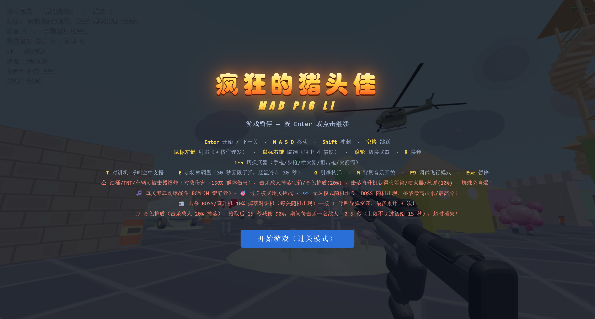

# 🎮 程序化 FPS 射击游戏

一个**零依赖、纯前端、程序化生成**的第一人称射击游戏（当前版本 **v11.4**）。双击 `index.html` 即可游玩 —— 无服务器、无构建、无安装。过关模式（5 关）+ 无尽模式，墙体掩体结构、全场景可破坏、猪头佳/机甲 BOSS 双 BOSS 战。


> 📌 所有模型（敌人、枪械、建筑、树木）全部由 three.js 代码程序化生成，**没有任何外部美术资源**。音效由 WebAudio 实时合成。



## ✨ 功能特性

- 🔫 **6 种武器**（枪模程序化圆润写实重建，数值均为当前 v11.4 版本）：
  - **手枪**（沙漠之鹰）：伤害 60 / 6 发每秒 / 12 发弹匣
  - **步枪**（M4A1）：伤害 35 / 15 发每秒 / **60 发弹匣**、备弹 360，开局自带
  - **喷火器**：持续伤害 **300/秒**，射程 **80**，火焰范围半径 **12**
  - **狙击枪**（AWP）：伤害 300 / 3 发每秒 / 12 发弹匣、备弹 120，右键 **4 倍瞄准镜**，**命中敌人附加小范围爆炸**
  - **火箭筒**：伤害 **6300** / 爆炸 **7650**，爆炸半径 **30**，射程 200
  - 数字键 `1-5` 或**鼠标滚轮**切换；所有武器右键瞄准；击毁直升机【必掉】火箭筒
- 🧱 **墙体掩体结构**：每张随机地图自动生成 **走廊 / 胡同 / L 形拐角 / 独立直墙段**（26~42 面掩体墙），供枪战走位
- 💥 **场景破坏规则**：墙体、箱子（**1500 血量**，需伤害累加才会彻底破坏）、车辆、集装箱、货柜、大树、油桶/TNT 等均可被武器打碎（含碎片特效），火箭筒爆炸范围破坏；但**房子、摩天轮、飞机、卡车等建筑类只能被猪头佳撞破**，玩家武器与爆炸均无法拆建筑
- 🐗 **猪头佳小BOSS · 5 种规格**：每击杀 10 名普通敌人随机出现（几率 −30%），同屏最多 **4 只**不同规格随机登场 —— 瘟疫猪头佳（0.5×，×0.7，灰棕/白激光，35%）、撼地尊猪头佳（1×，×1，原色/绿激光，30%）、镇海兽猪头佳（2×，×2.5，暗灰/蓝激光，10%）、灾厄猪头佳（3×，×3.5，暗青/紫激光，10%）、灭世猪头佳（4×，×5，黑/红激光，5%）；双眼激光 + 无差别冲撞，**优先攻击玩家**，90 秒超时自爆（爆炸规模随体型放大）
- 🤖 **机甲 BOSS**：每击杀 25 名普通敌人随机出现（几率 −30%，所有关卡+无尽），火箭炮 AoE、防御×2、移动速度 2.7，被障碍卡住会撞开障碍物；击败奖励核弹 + 空袭对讲机
- 👤 **三类普通敌人**：人类士兵 / 重装怪 / 蜘蛛（自爆）+ **直升机**（火箭弹 AoE，击毁掉武器/核弹/对讲机）
- 📻 **空中支援**：击杀 BOSS/直升机掉落对讲机，按 `T` 呼叫导弹空袭（可累积 **3 次**）；每获得 5000 分额外奖励空袭 ×1 + 满血恢复
- ☢️ **核弹**：宝箱/猪头佳/BOSS/直升机均可掉落，按 `G` 触发 **3 秒辐射倒计时**后引爆，毁灭全场敌人（不毁建筑/物品），对玩家自伤 30%
- ✈️ **喷气背包**：击杀普通敌人掉落 / 5000 分奖励，按 **`B`** 启动向上飞行 15 秒
- 🛡️ **金色护盾**：击杀普通敌人 **20% 掉落**，拾取后 15 秒减伤 90%，期间每击杀 1 名敌人 +0.5 秒
- 💊 **宝箱道具**（击杀敌人掉落，30 秒限时）：疾风（+100% 速度）/ 狂暴（+200% 伤害）/ 体魄（+200% 生命）/ 核弹（10%）
- 📦 **弹药/回血掉落**：击杀敌人 60% 掉弹药、30% 掉回血；蜘蛛额外掉火箭筒/喷火弹药
- 💥 **爆头机制**：命中头部伤害 **×30**，额外 **5%** 概率直接秒杀（BOSS 除外）
- 😡 **狂暴模式**：生命值 ≤30% 自动触发，伤害 +50%、射速 +50%、移速 ×3、击杀回血
- 🗺️ **过关模式**：5 关任务，击杀目标递增（30/50/70/90/110），每关程序化随机地图
- ♾️ **无尽模式**：无限波次 + 敌人强度成长，记录历史最高击杀/最高分（localStorage 持久化）
- 🌗 **7 时段昼夜氛围**：午夜/日出/早晨/正午/下午/日落/黄昏连续推移（整轮 300 秒），进游戏与每关开局**随机落在某一时段**；太阳东升西落、光色随之变化，入夜自动亮起**幽蓝月光 + 月亮 + 星点 + 流星**；雾色、背景、灯光、地形着色、水面与云朵染色全部跟随同一调色板
- 🤖 **哨兵机器人敌军**：普通敌人为 X战警风格的哨兵机器人（发光目镜/胸口聚变核心/活塞关节/能量步枪），4 套涂装区分同批敌人；夜间自发光部件配合昼夜系统
- 🌳 **程序化场景**：**起伏地形**（山丘/洼地/湖泊水面/草地/沙滩/泥地/高地，顶点着色，每次随机）+ 建筑、车辆、集装箱、飞机、大树、高墙、摩天轮、蘑菇、草地花丛、2 种飞鸟、**可攀爬瞭望塔**随机分布
- 🗺️ **超大地图**：可活动面积翻倍（约 128×128），地形随种子变化，每局地形与掩体布局都不同
- 🔊 **程序化硬摇滚 BGM**：每关一首 WebAudio 实时合成硬摇滚曲（失真强力和弦吉他 + 摇滚鼓组 + 贝斯，L1-L5 递进），无尽模式专属曲；**BOSS/猪头佳登场自动切「狂暴摇滚」高燃曲**，离场恢复；`M` 键静音
- 🎯 **真实打击音效（参考 CS）**：命中为低频闷响 + 清脆命中反馈，爆头更脆更响带骨裂尾音，死亡/受伤为低沉闷击，取代旧电子哔声
- ⚡ **性能优化**：全场景 MeshLambertMaterial、阴影关闭、特效对象池（tracer/spark/flame 复用）、pixelRatio 限制、烟雾精简；**v11.6 新增实体销毁时释放几何体/材质**（杜绝反复刷怪导致的 GPU 缓冲累积与越玩越卡）；渲染器启用 **ACES 电影级色调映射 + 半球补光**，运行流畅稳定
- 🛡️ **健壮性**：任何模块加载失败不崩溃，错误面板提示 + 占位模型兜底
- 🎮 **调试模式**：按 F9 开启，重力为零、无碰撞、自由飞行

## 🎮 操作说明

| 操作 | 按键 |
| --- | --- |
| 移动 | `W A S D` |
| 冲刺 | `Shift` |
| 跳跃 | `Space` |
| 射击（可连发） | 鼠标左键 |
| 瞄准（狙击 4 倍镜） | 鼠标右键 |
| 切换武器（循环） | 鼠标滚轮 |
| 切换武器 | `1 2 3 4 5`（手枪/步枪/喷火器/狙击枪/火箭筒） |
| 换弹 | `R` |
| 呼叫空中支援（对讲机） | `T` |
| 引爆核弹 | `G` |
| 喷气背包启动 | `B` |
| 进入/操作加特林碉堡 | `E` |
| 进入下一关 | `Enter` |
| 静音/恢复 BGM | `M` |
| 调试飞行模式 | `F9` |
| 暂停 | `Esc` |

## 📋 更新履历

### v11.37（2026-09-18）— 🐛 修复 BOSS「实体更新失败」崩溃

- 🐛 **根因**：`enemy.js` 的 `create: function (config)` 只声明了 1 个参数，但函数体内引用 `ctx`（v11.36 激光光束需要 `ctx.scene.add(beam)`）。`ctx` 不在 enemy.js 的 IIFE 作用域内 → `ReferenceError` → `buildEntity` 捕获后回退到占位模型（`userData = {}`），但 `rec.def` 仍指向 enemy 真模型（含 `update`）→ 每帧 `updateProjectiles` 访问 `u.projectiles.length` 崩溃，报错 `实体更新失败(dyn-boss-*): Cannot read properties of undefined(reading length)`。
- ✅ **修复 1（根因）**：`create: function (config)` → `create: function (config, ctx)`，`ctx` 正确传入，激光光束挂载到场景。
- ✅ **修复 2（防御）**：`buildEntity` 中 `create` 抛异常时，`def` 一并替换为无 `update` 的 fallback，占位模型不再被当真敌人更新。
- ✅ **修复 3（防御）**：`updateProjectiles` 加 `Array.isArray(u.projectiles)` 守卫。

### v11.4（2026-09-19）— 🔧 机甲 BOSS 全面修复

- 🐛 **`variant is not defined`**：`update` 函数直接引用 `variant`（`create` 的局部变量），改用 `u.variant`（已存入 userData）。
- ⚡ **移动速度提升**：`MECHA_VARIANTS` 速度 ×1.5～2.3（蜂群游侠 9→14，熔炉/裂变/天基 6→10，星轨 3→7）。
- ⚡ **射击速度提升**：`shootCooldown` 减半（1.5→0.6 / 1.0→0.4），火箭炮更密集。
- 🔫 **激光武器修复**：光束定位改 midpoint+scale 缩放至 60m，始终跟随 boss 方向扫射。
- 🚧 **障碍物绕行**：BOSS 在 `stopDist` 内仍以 40% 速度持续逼近玩家，`breakObstacleAhead` 频率提升（0.25→0.15s），范围加大（4→5m，伤害 400→500）。

- 🐛 **根因**：`enemy.js` 的 `create: function (config)` 只声明了 1 个参数，但函数体内引用 `ctx`（v11.36 激光光束需要 `ctx.scene.add(beam)`）。`ctx` 不在 enemy.js 的 IIFE 作用域内 → `ReferenceError` → `buildEntity` 捕获后回退到占位模型（`userData = {}`），但 `rec.def` 仍指向 enemy 真模型（含 `update`）→ 每帧 `updateProjectiles` 访问 `u.projectiles.length` 崩溃，报错 `实体更新失败(dyn-boss-*): Cannot read properties of undefined(reading length)`。
- ✅ **修复 1（根因）**：`create: function (config)` → `create: function (config, ctx)`，`ctx` 正确传入，激光光束挂载到场景。
- ✅ **修复 2（防御）**：`buildEntity` 中 `create` 抛异常时，`def` 一并替换为无 `update` 的 fallback，占位模型不再被当真敌人更新。
- ✅ **修复 3（防御）**：`updateProjectiles` 加 `Array.isArray(u.projectiles)` 守卫。

### v11.27（2026-09-18）— 🐗 猪头佳 5 规格尺寸真正生效 + 💀 溺水死亡两行标题

- 🐗 **尺寸失效根因修复**：旧版 `spawnPig` 在 cfg 里写死 `scale: [3,3,3]`，而 `buildEntity` 会在 `MODELS.pig.create` **之后**调用 `applyTransform`，把 cfg.scale 强制覆盖到实例上 —— 于是 pig.js 内部算好的变体缩放（0.5×/1×/2×/3×/4×）被全部冲掉，5 只猪头佳看起来一模一样大。修法：**cfg 不再写 scale**，缩放完全交给 pig.js 按 `基准3 × 变体倍数` 计算；`applyTransform` 的 `if (cfg.scale)` 判空跳过，变体缩放得以保留。
- 🐗 **5 规格参数按新表重定**（`models/pig.js` 的 `PIG_VARIANTS`）：

  | 级别 | 名称 | 尺寸 | 血量/伤害倍数 | 毛发色 | 激光 | 概率 |
  |---|---|---|---|---|---|---|
  | 1 | 瘟疫猪头佳 | 1.5 | **68500** ×0.7 | 灰棕 | 白 | 35% |
  | 2 | 撼地尊猪头佳 | 3 | **105000** ×1 | 原色深褐 | 绿 | 30% |
  | 3 | 镇海兽猪头佳 | 6 | **237500** ×2.5 | 暗灰 | 蓝 | 10% |
  | 4 | 灾厄猪头佳 | 9 | **522500** ×3.5 | 暗青 | 紫 | 10% |
  | 5 | 灭世猪头佳 | 12 | **1085000** ×5 | 黑 | 红 | 5% |

  同屏最多 4 只（`PIG_MAX`）；`damageStaticEntity` 的碰撞半径本就按 `inst.scale` 动态计算，大猪自动占更大碰撞圈。
- 🐗 **概率权重选变体**：`spawnPig` 从均匀随机改为按 35/30/10/10/5 权重抽取（5 项合计 0.9，剩余 10% 回落至撼地尊，与规格表保持一致）；`spawnPig(forceIdx)` 支持测试指定变体。
- 💥 **自爆随体型放大**：`onPigSelfDestruct` 接收变体信息，爆炸半径 `20 × 尺寸倍数`、爆炸伤害 `260 × 伤害倍数`、波及范围 `28 × 尺寸倍数`（对玩家单次伤害仍由 `hitPlayer` 钳制 5~15）；提示文案带变体名。
- 💀 **溺水死亡两行标题**：第一行加粗主标题 `💀 你被淹死了！`，第二行副标题 `小朋友，不要去水边玩耍！`（黄色高亮、置顶显示，过关/无尽两种结算画面一致）。`showStatsScreen`/`showEndlessEnd` 改用 `innerHTML` 以支持加粗标签，并新增 `subtitle` 参数，其余调用点兼容不变。
- 🔧 **缓存版本号 `?v=1127`**：全部模型脚本统一刷新缓存键，杜绝浏览器沿用旧版 `pig.js`。
- ✅ 语法括号配平 5689/5689；headless 实测 `pigVariantTest` 变体 scale=1.5/3/6/9/12、hp=68500/105000/237500/522500/1085000 全命中；端到端 `spawnPigVariantTest` 走完整 `spawnPig→buildEntity→applyTransform` 链路 scale=1.5/3/6/9/12 全命中。

### v11.26（2026-09-18）— 🚁 直升机射线排除自身 + 💥 爆头×30/5%秒杀 + 🚀 火箭筒×5 + 🏢 建筑仅猪可破坏

- 🚁 **直升机打不中根因修复**：驾驶时相机位于机身内部，`raycastShot` 从 `camera.position` 发射，`intersectObjects(scene.children, true)` 会先命中直升机**自身的 mesh**（`buildEntity` 给每个 mesh 写了 `entityId`），导致射线被自己挡住。修法：`raycastShot(dir, excludeEntityId)` 新增排除参数，开火三处调用均传入当前载具 ID；配合右键方形瞄准镜（FOV 25°）完成对齐。
- 💥 **爆头再×3 + 秒杀概率 5%**：`dmg *= 30`（在 ×10 基础上再提升 3 倍），命中头部额外 **5%** 概率直接毙命（BOSS 除外）。
- 🚀 **火箭筒伤害×5、范围×5**：直射 1260 → **6300**，AoE 1530 → **7650**，爆炸半径 6 → **30**。
- 🏢 **建筑仅猪头佳可破坏**：`isDestructible(rec, attackerKind)` 增加攻击者类型，`building / ferriswheel / plane / truck / container` 五类场景建筑只允许 `attackerKind === 'pig'` 破坏；玩家武器、爆炸、BOSS 均无法拆建筑。`breakObstacleAhead` 与撞击推挤两处调用同步传入类型（猪传 `'pig'`，BOSS 传 `'boss'`）。
- 🔧 **缓存版本号 `?v=1126`**：统一刷新模型脚本缓存键。
- ✅ 语法括号配平通过；线上 `versionTag v11.26`、`pig.js?v=1126`、`dmg *= 30`、`damage: 6300` 已 curl 逐项核对。

### v11.18（2026-09-17）— 🎷 经典蓝调 BGM + 🚁 直升机迫降可驾驶 + 🎡 摩天轮修复 + 🔊 枪声修复
- 🎷 **BGM 改经典蓝调（Blues）**：吉他 + 钢琴为主音，**完全无鼓点**。7 首 12 小节蓝调（I–IV–I–V）慢速 shuffle，属七/大七和弦色彩；新增 `bgmPiano`（正弦+泛音）、`bgmGtrPluck`/`bgmGtrChord`（蓝调吉他）。mock AudioContext 跑 7 轨 × 64 步 0 异常。
- 🚁 **直升机迫降 + 玩家驾驶（新功能）**：击杀满 3 只猪头佳后，玩家击毁直升机 **30% 概率改为迫降坠地**（而非空中爆炸）。走近按 **E 登机驾驶**——直升机血量 15000、火箭炮对敌伤害 10000、射速 5 发/秒，可攻击地面与空中所有敌人；WASD 飞行 / 空格升 / Ctrl 降 / 左键开火 / E 离机；敌人伤害转嫁到直升机血量，被击毁则爆炸、玩家掉回地面继续战斗。HUD 显示装甲值与登机提示。
- 🎡 **摩天轮悬空修复**：根因是模型 A 型支架腿长 15.5、中心在 12.3s，底部只到 ~4.7s 够不到地面、与脚墩断开 → 看起来悬浮。改腿长 14.0、中心 7.0s，底部落地、顶部接轮心。
- 🌸 **台阶全删 + 花池**：删除建筑旁与瞭望塔的**全部** step 实体（塔基改放花池），建筑旁花池出现率提高、地图散布 5–9 座多色花池。⚠️ 取舍：瞭望塔不再可攀爬登顶。
- 🔊 **偶发开枪无声修复**：射击前 `AC.resume()`（失焦/切后台后 AudioContext 被浏览器挂起是主因）+ 新增总限幅器 `sfxDest`（DynamicsCompressor），全部音效经统一总线，防密集枪声互相压低/吞音。
- 🩹 **修复 spawnSmoke 崩溃**：`ctx.spawnSmoke` 直接用了懒初始化的 `_smokeGeo`（首次爆炸前为 null）→ 射线命中 null 几何体抛 `morphAttributes of null`。改为懒创建。
- ✅ 全量语法编译通过；headless 启动 0 运行时错误；直升机迫降→落地→登机→开火→坠机全链路自检通过。

### v11.25（2026-09-17）— ♾️ 无尽波次 10% 阈值触发 + 新旧波累积

- ♾️ **波次 10% 阈值**：普通敌人剩余<10% 即倒计时 5 秒进下一波，无需全灭；BOSS/猪头佳不阻塞。
- ♾️ **新旧波累积**：旧波残余与新波同屏共存；HUD 显示剩余数量与百分比。
- ✅ `node --check` 全文件通过；headless Chromium v11.25 启动 0 JS 异常。

### v11.24（2026-09-17）— 🚁 直升机方形瞄准镜 + 🐗 猪头佳 5 种规格

- 🚁 **直升机方形瞄准镜**：驾驶时右键激活方形瞄准镜（FOV 25°，火箭炮风格），准星居中+×4 标识。
- 🐗 **猪头佳 5 种规格**：瘟疫(×0.5,灰棕,白激光,35%) / 撼地尊(×1,原色,绿激光,30%) / 镇海兽(×1.5,暗灰,蓝激光,10%) / 灾厄(×2,暗青色,紫激光,10%) / 灭世(×3,黑色,红激光,5%)；血量伤害等比缩放，同屏最多 4 只。
- ✅ `node --check` 全文件通过；headless Chromium v11.24 启动 0 JS 异常。

### v11.23（2026-09-17）— 🌊 入水扣血15HP+死亡提示 + 💥 爆头×10/2%秒杀 + 🚀 火箭筒伤害×2

- 🌊 **入水扣血调整**：安全期结束后扣血从每秒10HP改为每秒15HP；溺水死亡标题改为「💀 你被淹死了！」+ 温馨提示「小朋友，不要去水边玩耍！」。
- 💥 **爆头伤害×2**：爆头伤害从×5提升为×10；额外增加2%概率的一击必杀（非BOSS敌人）。
- 🚀 **火箭筒伤害×2**：直接伤害630→1260，AOE伤害765→1530。
- ✅ `node --check` 全文件通过；headless Chromium v11.23 启动 0 JS 异常。

### v11.22（2026-09-17）— 🚁 直升机射击命中修复 + 🌊 入水延迟扣血

- 🚁 **直升机射击命中修复**：射线起点从机腹（`inst.position+0.5`）改为相机位置（`camera.position`），方向取 `getWorldDirection`，与准星完美对齐，解决驾驶视角准星瞄准却打不中目标的问题。
- 🌊 **入水延迟扣血**：入水前 10 秒为安全期（仅倒计时显示，不扣血），安全期结束后才开始持续扣血（每秒-10HP）；HUD 区分「安全期 Xs」与「⚠️扣血中」两种状态。
- ✅ `node --check` 全文件通过；headless Chromium v11.22 启动 0 JS 异常。

### v11.21（2026-09-17）— 🚁 直升机视角精简 + ✈ 喷气背包高度×2/升降键位统一

- 🚁 **驾驶视角隐藏螺旋桨**：玩家驾驶直升机时 `mainRotor`/`tailRotor` 隐藏（严重遮挡第一人称视野），离机/迫降/落地后自动恢复旋转可见。
- 🚁 **座舱 HUD 精简**：删除暗角渐变、四根金属支柱、仪表盘、炮管炮口焰、橙色圆形锁定瞄准圈；只保留从驾驶室往外看的干净视角 + 绿色十字准星 + 右下燃油进度条。
- ✈ **喷气背包高度×2 + 键位统一**：飞行上限提高一倍（`getJetpackCeiling()×2`），升降控制改为**空格上升 / Ctrl 下降 / 松手悬停**（与直升机驾驶键位一致，原为只升不降）。
- ✅ `node --check` 全文件通过；headless Chromium v11.21 启动 0 JS 异常。

### v11.20（2026-09-17）— 🗼 瞭望塔楼梯修复 + 🚁 直升机座舱 HUD + ⛽ 燃油60秒 + 🎯 敌人集火直升机 + 🧱 墙体通道修复

- 🗼 **瞭望塔螺旋楼梯修复**：楼梯半径 2.0→1.0（移入塔内四腿之间），可见木制台阶 48 级绕中心柱盘旋上升（每级带切线旋转），护栏 TubeGeometry 跟随，+z 入口侧有红色小旗引导；碰撞体同步对齐半径 1.0 + `stepRise`；塔顶加特林移至 +z 平台边缘（面向外侧），登顶即可看到/使用。
- 🚁 **直升机座舱第一人称 HUD**：挡风玻璃框架（渐变暗角+四根支柱+仪表盘）、底部炮管+炮口焰指示器、绿色十字准星、橙色/红色圆形锁定瞄准圈（带角标）、右侧高度指示条、低燃油仪表灯变红。
- ⛽ **直升机燃油系统**：登机后 60 秒倒计时；≤15 秒警告；耗尽后强制下降迫降，允许水平移动但不能升高；按 E 可紧急跳机；落地后 5 秒倒计时爆炸；HUD 右下燃油进度条实时显示。
- 🎯 **敌人集火直升机**：驾驶直升机时所有敌人射程 ×1.5、射击冷却 ×0.6，全方位优先攻击玩家直升机（已有的 `player.pos` 同步+直升机分流伤害机制不变）。
- 🧱 **建筑碰撞修复**：`collideWorld` 对建筑使用 `cfg.w/cfg.d` + 旋转后 AABB 计算更紧的碰撞盒（排除屋顶/烟囱/底裙的 AABB 溢出），修复旋转建筑间通道被不可见碰撞堵塞的问题。
- ✅ `node --check` 全文件通过；headless Chromium v11.20 启动 0 JS 异常 0 运行时错误。

### v11.19（2026-09-17）— 🔇 BGM 全删 + 🗼 瞭望塔可攀爬 + 💧 物品避水 + 🎯 分数/迫降/伤害修正

- 🔇 **删除全部 BGM**：移除蓝调曲库、WebAudio BGM 引擎、七轨调度器、延迟/失真/铜管等声部函数，`bgm` 对象保留空 API（`playTrack`/`stop`/`pause`/`resume`/`toggleMute` 全 no-op），所有调用点零改动即兼容。**音效（SFX）完全不受影响**。
- 🗼 **瞭望塔可攀爬回归**：`watchtower.js` 内置 48 级螺旋楼梯（绕中心柱上升，护栏用 TubeGeometry 连续弧线），`scene-layout.js` 生成对应 48 个隐形碰撞 `step`（`hidden:true` 仅碰撞不渲染），再加平台碰撞体；顶部放置加特林碉堡，登顶即可使用。
- 🎡 **摩天轮 1 座×2 倍**：每图固定生成 1 座（不再 1–2 随机），尺寸 1.3–1.7（原 0.65–0.85 翻倍），通过 `placeLargeProp` 严格避让建筑/车/集装箱/飞机，杜绝穿模重叠。
- 💧 **物品建筑避水系统**：新增 `inWater(x,z,margin)` + `dryRand(lo,hi,margin,tries)`，建筑/花池/油桶/TNT/灯柱/射击靶/拾取物/武器掉落/加特林/瞭望塔/摩天轮/大树/高墙/草丛/蘑菇均不可生成在水面以下，兜底时优先找干地。
- 🎯 **BOSS 分数修正**：命中敌方可破坏物不再每击都加 `cfg.score`（BOSS 多次命中会乱加分），改为"摧毁时才加分"；击杀 BOSS 分数 2000→10000。
- 🚁 **迫降触发改为积分≥20000**：原"杀满 3 只猪头佳"改为"当前积分≥20000 后，击毁直升机 30% 概率迫降"。
- 🔧 **敌人伤害钳制 5~15**：原 5~20 收紧为 5~15（核弹自伤 `{noClamp:true}` 不受影响）。
- ✅ headless Chromium 启动 0 JS 异常 / 0 ReferenceError；`node --check`（提取内联脚本）通过。

### v11.17（2026-09-17）— 🎸 无主之地风 BGM + 🏠 建筑多样重建模 + 🌸 花池 + 💀 溺水机制

- 🎸 **BGM 重做为无主之地（Borderlands）风格**：暗色工业沙漠蓝调——palm-muted 失真吉他闷音 riff 作核心节奏层、trip-hop 鼓（带 swing 后半拍延迟）、蓝调滑音主音 turn-around、big-band 铜管 stab、blurp 贝斯、低频张力 drone 铺底。中速 swagger（88–112 BPM）小调；整体音量再降（0.16→0.115）并把母带低通压到 6.2kHz，**靠音色而非音量取狠**，彻底解决"太吵"。7 条轨（含 BOSS 工业狂暴）mock AudioContext 跑满 64 步 0 异常。
- 🏠 **建筑重新建模（去方块感）**：`building.js` 全新 5 种造型随机——人字顶小屋 / 两层阁楼(阳台) / L 形住宅(侧翼) / 圆塔小屋(锥顶圆窗) / 平房+门廊(立柱雨棚)；挤出三棱山墙屋顶带出檐、圆角墙体、石裙底座、发光窗+窗框、门框门板、烟囱顶饰。墙面/屋顶各走鲜艳调色板随机配色，彼此有别。单栋仅 6–8 网格，配合合批不掉帧；无头渲染 5 造型包围盒/网格数正常。
- 🌸 **台阶 → 长方形花池**：删除建筑旁装饰台阶，新增 `flowerbed.js`（砖石/木框 raised bed + 深色泥土 + 10 株多色花：红/黄/橙/粉/紫/白/蓝 + 绿叶），并沿地图散布 5–9 座（避开建筑/水面/出生区）。瞭望塔攀爬台阶（`climbOnly`）保留，不影响登顶狙击。
- 💀 **溺水机制（反作弊）**：玩家进入水深 >0.5m 水域触发 **10 秒窒息倒计时**，每秒扣 10 HP（无视护盾/钳制），气尽即"溺水窒息"死亡；出水快速回气。此前"深水免疫核弹"仍生效，但代价是会淹死——杜绝长期泡水无敌。HUD 实时显示剩余气息与窒息警告。
- 🐛 **减 bug / 综合检查**：全量 JS 语法编译通过；headless 启动 0 运行时错误；实机截图确认建筑/花池/地形/天空渲染正常。

### v11.16（2026-09-17）— 🚀 火箭筒 ×3 + 🌊 敌人避水 + 💣 深水核弹免疫 + 🔧 大物件穿模修复
- 🚀 火箭筒对敌伤害 ×3（直击 210→630、AOE 255→765）。
- 🌊 敌人（士兵/猪头佳/蜘蛛）避开水深 >0.5m 水域：前方入深水则沿水岸左右滑动绕行，四周皆深水则原地停留。
- 💣 玩家身处 >0.5m 深水中引爆核弹可免于自伤（深水作掩体）。
- 🔧 修复大物件穿模：车/货车/集装箱/飞机随机放置时做重叠检测 + 重试，不再镶嵌进建筑墙体或互相堆叠（30 种子 1998 次检测 0 穿模）。

### v11.15（2026-09-17）—  修复合批吞零件 + 🎛 BGM 一度改电子 DJ
- 🩹 **修复静态合批吞零件严重 bug**：旧 `staticBatchMerge` 把全部网格收进 `moved[]` 却只重建 ≥2 件的材质桶，导致单件桶（树干/墙体/摩天轮底座/油桶桶身等）被删除后未回填 → 部件消失。改为只删除真正被合批消费的零件（`consumed[]` 跟踪）。
- 🎛 补回电子 DJ 重构时误删的 `bgmCrash` 函数定义。

### v11.14（2026-09-16）— 🚀 静态场景通用合批：draw call 再降 47%
- 🧩 **一处改动覆盖全部静态道具**：主程序在建好"无 update 动画且非动态"的实体后，按 **材质分桶** 把该实体的所有零件烘焙合并成 1 个网格（`ROUND.merge` 支持矩阵输入，可正确处理嵌套子节点；线框 LineSegments 与网格分桶不混装；单零件桶保持原样不合并）。覆盖树/大树/台阶/楼/集装箱/花盆/油桶/TNT/障碍/卡车/车辆/飞机/高墙/草地/木箱/围墙等。
- 🧯 **安全边界**：只处理静态无动画实体（摩天轮、飞鸟、灯柱、加特林、云、地形、枪械一律不动）；带 `userData.noBatch` 的零件跳过；合并结果标记 `__shared = false` 随实体销毁正常释放，而作为输入的跨实例共享几何体绝不释放；合批异常时静默退回原始零件，不影响游戏。
- 📉 **实测（无头 Chromium 640×360 真实游戏页，renderer.info 一帧两遍合计）**：每帧 draw call **1053 → 557（−47%）**、网格 **1561 → 759（−51%）**、唯一几何体 **1308 → 628**、唯一材质 185 → 146。
- ✅ **回归确认**：贴地校验 `badCount = 0`（最大 0.077m、均值 0.003m）、围墙 32/32 段贴地、玩家 `playerErr = 0`、无 JS 异常与模块加载错误；命中/爆头仍按根节点与高度判定，碰撞盒由 `Box3.setFromObject` 取合并后表面，行为不变。
- ⚠️ **剩余项（已量化）**：仍有 `step`（每级 3 个零件分属 3 种材质，无法跨材质合批）与 `ferriswheel/birds/lamp/gatling/target` 等带动画模型保持多网格；进一步收益需要"顶点色 + 单材质"方案，等上机实测反馈后再决定要不要做。

### v11.13（2026-09-16）— 🤖 士兵改为「哨兵」机器人 + 性能与 BGM 流畅度整治
- 🤖 **普通敌人士兵重新建模为机器人（X战警「哨兵」风格）**：拉长头盔 + 头顶冠鳍 + **发光目镜光带** + 胸口聚变核心 + 背部推进器环/排气管 + 活塞式液压关节 + 双臂三爪 + 能量步枪（枪口发光器）；4 套涂装（钢灰/钴蓝/军绿/铬白）区分同批敌人。爆头判定（高于 1.68×体型）、受击闪红、AI/武器/掉落契约完全不变；夜间目镜与胸口核心自发光，配合 v11.12 的时段氛围。
- 🎸 **BGM 卡顿修复（两处根因）**：
  1. 每个鼓点都 `createBuffer()` 并**逐样本 `Math.random()` 现填噪声**、同时新建一个 BiquadFilter —— 16 分音符 hi-hat 在 176BPM 下约 12 次/秒，主线程持续分配 + 音频线程反复建滤波器。改为**复用一条预生成白噪缓冲**（随机起播点保持听感）+ 按 `type:freq` 缓存滤波器节点（每击节点数 3→2、**零缓冲分配**）。
  2. 预调度余量只有 0.15s，**画面掉帧会把音频调度的 `setInterval` 一起拖慢** → 鼓点追不上时间轴，漏排/挤成一团。余量提到 0.5s，并在被长时间挂起（切后台/大卡顿）后重新对齐时间轴，避免一次性补排几十步造成的"机关枪爆音"。
- ⚡ **性能整治（先量化再改）**：无头实测 v11.12 基线为 **每帧 1068~1095 次 draw call、1497~1539 个网格、1326 个唯一几何体、661 个唯一材质、41 张纹理** —— 掉帧主因是"每个小零件一个网格、每个实体一套几何体/材质"（2 座摩天轮 232 个网格、60 级台阶 120 个网格、5 丛草 110 个、10 团云 100 个、68 段围墙 68 个几何体 + 68 个材质）。本轮改动：
  - **形状工厂自带参数缓存**（`roundedBox/roundedCyl/cylZ`）：全工程"每实体新建几何体"的写法自动变成跨实例共享；已核实没有任何模型在运行时改写几何体顶点内容。
  - **共享材质工厂** `MARIO.matS/basicS`：28 个静态模型切换到缓存材质（逐个核实它们运行时不改材质属性）；会改材质的 6 个文件（enemy 受击闪红 / spider / target / gatling / gun / spawner）保持每实例独占，避免"一只中弹全场变红"。
  - **同材质部件烘焙合批**：新增 `ROUND.merge/batcher`，草地花丛 22 网格→按材质 7 个、10 团云 100 网格→10 个（云布局改为确定性伪随机，换关复用同一批烘焙结果，不再持续累积 GPU 缓冲）。
  - **机器人建模即按此规范**：几何体全局缓存 + 每只只有个位数网格，一波刷 20 只不再产生几百次上载/释放循环。
  - `wall`/`crate` 的 Canvas 贴图提升为模块级单例（纹理 41→8）；静态且无动画的实体（楼/墙/树/箱/台阶/花盆等）贴地完成后**一次性固化世界矩阵**，省下每帧上千个对象的 `matrixWorld` 重算（有 `update` 动画的模型不受影响）。
- 🧪 **验证**（无头 Chromium 真实游戏页 + `renderer.info` 一帧两遍合计）：唯一材质 **661 → 173~185**、纹理 **41 → 8**、着色器程序 18 → 15；贴地回归 **badCount = 0**（最大 0.035m、均值 0.003m）、围墙 32/32 段贴地、玩家 `playerErr = 0`；进入 playing 后正常刷敌，**无任何 JS 异常与模块加载错误**。
- ⚠️ **诚实记录（掉帧尚未根治）**：每帧 draw call 仅从 **1068~1095 → 976~1053**（约 −9%）。剩余大头已量化定位：**摩天轮 2 座 232 网格、树 156、台阶 144、集装箱 111、建筑 90** —— 它们仍是每个零件一个网格。下一步把这三项也按机器人/草地的做法做同材质合批（预计还能再降四到五成）。本轮帧时数值来自软件渲染环境，不能代表你的真实硬件表现，请以实际上机体验为准并反馈。

### v11.12（2026-09-16）— 🌗 7 时段昼夜氛围 + 彻底修复悬空/陷地
- 🌗 **场景不再只有白天**：世界被切成**午夜 / 日出 / 早晨 / 正午 / 下午 / 日落 / 黄昏** 7 个氛围时段，整轮 300 秒连续推移（关键帧调色板插值，无跳变）；**进游戏与每关开局随机落在其中一个时段**。
- 🌍 **整个世界跟着时段走**（不只是天空换色）：太阳**东升西落**沿弧线运行，光色由清晨暖黄→正午炽白→黄昏橙红；日落后**幽蓝月光自动亮起**并升起月亮（带环形山的立体月面）；夜空出现**星点与偶发流星**。同步驱动平行光/环境光/半球光的颜色与强度、**雾色与背景色**、地形着色器（光向/光色/环境光/雾）、水面反光色、云朵染色 —— 一套调色板统一整幅画面。
- ☁️ **云朵 3D 蓬松感**：10 组多球簇云（10 团不同大小球体组合）环绕天穹、缓慢漂移，受光产生明暗体积感并随时段染色（白天白、晨昏暖橙、夜间青灰）。
- ☀️ **太阳立体受光球体 + 光晕**：自定义球体着色器做**临边变暗**（limb darkening）呈真实球感，日面颜色随高度由橙红渐变炽白，外加一层加色光晕。
- 🐞 **彻底修复悬空/陷入地面（用户重点报的 Bug，4 处根因逐一根治）**：
  1. **落地面 ≠ 渲染面**：实体与玩家按连续解析噪声 `heightAt` 落地，而地形网格只是 1.875m 间隔的线性插值面，两者必然错位数十厘米~1m。新增 `TERRAIN.groundAt()` 直接对**地形网格顶点高度表**做双线性采样，落地高度与看到的表面严格一致。
  2. **压平=挖坑**：`flatten` 旧逻辑把中心**强行压到 y=0**，在山丘上等于挖一个深坑 → 建筑/瞭望塔整体沉到地面以下。改为「保持局部原高的**平整台地**」（核心平底、外缘平滑过渡回自然地形）。
  3. **压平点跨关卡累加**：6 份关卡布局在页面加载时把压平点全部累加进同一列表且从不 reset → 地形被挖出大量与本关无关的坑洞，且高度查询随重开无限变慢。改为压平点随布局输出（`layout.flattens`），每关重建前 `resetPads()` 后只应用本关数据。
  4. **整条 128m 围墙只按中心点落地**：一头扎进地里、另一头悬空。改为**每边 8 段 × 16m 分段各自贴地**；并给大型落地物（楼/瞭望塔/摩天轮/高墙/飞机/卡车/集装箱/车辆/加特林）自动登记平整台地。
  - 另修：台阶/瞭望塔踏板此前按**绝对 y** 放置，在起伏地形上被整段埋进地下；落地规则改为「保留布局作者的离地高度并整体抬到地形面上」（同时修好 0.5m 高的箱子半陷地、0.8m 悬浮道具被压平等问题）。
  - **悬浮道具挤在同一高度**：`pickup / weapon / chest / walkie` 是在**首次 update** 才懒抓浮动基准，而基准取自**共享暂存位** `ctx.spawnPos.y` —— 那时全场实体早已建完，抓到的是"最后建的那个实体"的高度，于是所有悬浮道具停在同一绝对 y：高地上陷进坡里、洼地里凭空悬空（实测偏差最大 2.8m）。修复：主程序贴地完成后把本实体高度写进 `inst.userData.groundBase`，模型一律以它为准；并把 `walkie`/`shield` 补登进 `GROUND_PROPS`。
  - **玩家被"钉"在半空**：只要 `onGround` 仍为 true 就把下落速度归零，而出生点写死 `y=1.6`；当该处地形低于 1.6（每局随机种子决定，约半数地图）玩家就永远悬在空中落不下来（实测高出地面 0.8m）。修复：仅当已贴地表 6cm 内才归零下落速度，离地超过 6cm 交给重力落回地面（站在箱子/台阶上仍由 `collideWorld` 每帧吸附台阶顶面，行为不变）。
- ⛰️ **地形更合理**：噪声统计中心随种子漂移（实测不同种子水面占比 0%~66%，某些局整张图泡在水里）→ 加入**高度场标定**，把高程归一到设计带宽、湖面按 lakeField 自身分位数取盆，水面占比稳定在约 2%~14%、地图边界带强制抬干（围墙必定站在干地）。起伏幅度按用户授权由 ±10m 降到 ±约6m，坡更缓、贴地误差更小；网格加密到 1.5m 间隔。
- ⚙️ **性能**：每帧落地由「遍历全部压平点的解析噪声」改为 **O(1) 网格采样**（实体越多收益越大，同时消除压平点累加造成的持续增长）；星空为单个 `Points`（1 次 draw call）、流星 3 片面片，**白天整组 visible=false 零开销**；天空渐变/朝日暖辉在片元里算，**不逐帧重绘贴图、不重编译 shader**。
- 🧪 **无头 Chromium 校验（本地同源于 http 加载真实游戏页）**：
  - 贴地校验改用 `Raycaster` 与**真正渲染出来的地形三角面**求交比对（已排除水面干扰）：247 个静态落地实体 `badCount = 0`，平均偏差 **0.005m**、最大 **0.079m**；外围边界围墙 **32/32 段全部贴地**（最大 0.057m，修复前最大 2.294m 一头扎进地下）；玩家 `playerErr = 0`（修复前悬空 0.799m）。
  - 7 个时段逐一驱动验证：太阳高度角 −0.96（午夜）→ 0（日出）→ +0.96（正午）→ 0（日落）→ −0.58（黄昏），东-天-西弧线成立；雾色/主光/环境光随相位连续变化，`envWired` 全为 true；星点与流星仅在 night 因子达标时出现（午夜/黄昏 on，白天 off）。
  - 模块加载零错误、无 JS 异常、自定义着色器（天穹/日面/月面/地形）无编译告警（唯一提示为无头环境正常的 pointer-lock 拒绝）。
  - 地形标定复测 12 个随机种子：水面占比 **1.6% ~ 14.2%**（修复前同一套代码可漂移到 0% ~ 66%），地图边界带高度恒在水位之上。
  - 无尽模式回归：进入 `playing`，第 1 波队列 22（20 普通 +1 BOSS +1 猪头佳）按节奏递减至 3、场上存活敌人 3 → 波次刷敌正常。

### v11.11（2026-09-16）— 🌌 天空/云/太阳立体化 + 无尽模式按 WAVE 刷敌 + 修复悬空陷地
- 🌌 **天空更自然**：天空渐变去饱和（天顶柔蓝、地平线近白），整体偏白呈现深空自然感；雾色同步提亮为淡蓝白（0xdcefff），远景不再刺眼。
- ☁️ **云朵 3D 立体化**：由“白色色块”改为多团蓬松球簇（受光产生明暗体积感），散布于天穹，不再是平面贴片。
- ☀️ **太阳 3D 立体化**：改为受光球体（带明暗交界呈现立体球感）+ 加色光晕，不再是扁平圆点。
- ♾️ **无尽模式改为按 WAVE 刷敌**：第 1 波普通敌人 20 名 + BOSS 1 + 猪头佳 1；每波普通敌人 ×1.2 递增、BOSS 与猪头佳各 +1；每波清场后提供 5 秒安全时间供玩家休整，倒计时结束再刷下一波（原“无尽随机刷怪”改为有序波次）。
- 🐞 **修复悬空/陷地（关键）**：根因是地形网格此前为**平面（y=0）**，而所有实体/玩家按 `heightAt`（含 flatten、振幅 ±10m）落地，二者不一致导致物品/建筑/树木悬空、玩家走动时悬空或陷地。修复：地形网格顶点贴合 `heightAt`（缩放反算世界坐标），与实体/玩家落地高度完全一致；并同步雾色/地形雾色避免地形发灰。无头 Chromium 校验：加载无异常、地形网格已位移（实测起伏约 ±6m）、无尽模式进入「playing」且第 1 波队列 = 20 普通 +1 BOSS +1 猪头佳。

### v11.10（2026-09-16）— 🚁 火箭筒稳定产出 + 纹理化生物群系地形 + 林地聚集 + 起伏 ±10m
- 🚁 **火箭筒稳定产出（修复“从没见过火箭筒”）**：根因之一是地面掉落物（weapon/pickup）未登记进 `GROUND_PROPS`，在起伏地形上会埋进山坡导致“看不见/捡不到”；其二是直升机掉落概率仅 30% 且偏稀有。修复：将 `weapon`/`pickup` 登记进 `GROUND_PROPS` 并让悬浮掉落物以贴合后的地形高度为浮动基准；直升机击毁**改为必掉火箭筒**（满足“至少 30%”）。
- 🏞️ **生物群系纹理化**：地形按高度分群系（湖底淤泥 / 沙滩 / 草地 / 泥地 / 岩石 / 高地），各群系使用独立程序化纹理（草地斑驳、沙地颗粒、泥地斑块、岩石裂纹），在片元着色器中按高度平滑混合并叠加坡度岩石；水面改为带滚动波纹的半透明动画材质。
- 🌲 **林地聚集 + 巨树**：树木由均匀散布改为 3~4 片“林地”高斯聚集（更森林感），林地内 5% 为**体型≈2 倍现有大树的巨树**。
- ⛰️ **地形幅度 ±约10m**：大起伏振幅上调（±~9m + 湖盆下凹），同时降低噪声频率使坡更缓；建筑/瞭望塔/出生点 flatten 半径加大，保证战斗与攀爬瞭望塔顺畅、不卡碰撞。
- ⚙️ 无头 Chromium 校验：页面加载无 JS 异常、地形 ShaderMaterial 编译通过、游戏正常启动。

### v11.9.1（2026-09-16）— 🐛 修复启动崩溃（点「开始游戏」无反应 / `reading 'sky'`）
- 🐞 **根因**：v11.9 的地形贴合特性（`buildEntity` 内 `if (window.TERRAIN && GROUND_PROPS[cfg.model])`）引用了 `GROUND_PROPS`，但该变量直到文件后部才 `var` 声明；而主脚本在**加载阶段**就会遍历 `LAYOUT.entities` 调 `buildEntity` 构建首个实体 `sky`，此时 `GROUND_PROPS` 仍为 `undefined`，触发 `undefined['sky']` 抛错并使整个 IIFE 中断——开始按钮监听因此未挂载，表现为「点了开始游戏没反应」。
- 🔧 **修复**：将 `var GROUND_PROPS = {...}` 前移到「加载时构建实体」之前；并对两处 `GROUND_PROPS[cfg.model]` 访问加 `&& GROUND_PROPS` 防御性守卫。无头 Chromium 验证：启动不再报错、场景正常构建（DOM 254KB），仅剩无害的 Pointer Lock 需用户手势提示。

### v11.9（2026-09-16）— 🏞️ 画面鲜艳化 + 起伏地形 + 地图翻倍 + 天空/喷火修复
- 🎨 **画面去灰更鲜艳（马里奥3D风）**：关闭 ACES 色调映射（它会压灰高饱和色）改线性输出；雾色调提亮为天空蓝并推远（near 90 / far 340），远景不再发灰。
- 🏞️ **起伏地形替代纯平地板**：`floor.js` 重写为程序化高度场（确定性值噪声，每次随机种子）——山丘/洼地/**湖泊水面**/草地/沙滩/泥地/高地，**顶点按生物群系着色**；玩家与敌人按 `TERRAIN.heightAt` 贴地行走；建筑/瞭望塔脚下自动压平防穿模。
- 🗺️ **可活动地图面积翻倍**：边界墙 ±45→±64（约 128×128），玩家钳制/刷怪点/掩体/道具范围同步外扩。
- ☁️ **天空修复**：云朵改无光照纯白 `MeshBasicMaterial`（不再发灰）、太阳改亮金黄、天空渐变更饱和湛蓝。
- 🔥 **喷火器音效重做**：低频燃气轰鸣 + 幅度调制湍流咆哮 + 高速燃气嘶嘶三层，更像真实火焰喷射。
- ⚙️ headless 校验：地形高度无 NaN、有起伏与水面洼地、flatten 生效、mesh 构建正常；布局道具全在新界内；mock AudioContext 跑通喷火/全音效与全 BGM 轨。

### v11.8（2026-09-16）— 🔊 音频真实化：每枪专属枪声 + 真实爆炸 + 电吉他主导硬摇滚
- 🔫 **每把枪射击音色各异（真实枪械特性）**：`gunShot` 升级为 crack(枪口激波) + punch(中频枪身"砰") + thump(低频口径重量) + tail(空间尾音) + echo 五层。手枪清脆短小、步枪干净急促、霰弹低频浑厚爆炸感、狙击最响最浑厚带长尾多重回声。
- 💥 **真实爆炸音效**：新增 `explosionSfx`（脆裂 + 低通扫频爆炸主体 + 低频 boom + 长尾隆隆），核弹/空袭/火箭/油桶连锁统一替换，体量随 scale 缩放。
- 🎸 **硬摇滚改为电吉他主导**：主音 hook 换成失真电吉他（双锯齿 tanh 削波 + 揉弦 vibrato），riff 吉他音量抬高、贝斯压低，整首以电吉他为主线。
- ⚙️ 全 WebAudio 程序化合成、节点即用即弃；mock AudioContext 无头跑通全轨排程 + 全枪声/爆炸，无运行时错误。

### v11.7（2026-09-16）— 🎸 音频重做：硬摇滚 BGM + 真实 CS 打击音效
- 🎸 **BGM 改硬摇滚**：WebAudio 合成失真电吉他强力和弦 riff（tanh 削波 WaveShaper + 高低通）+ 摇滚鼓组（底/军/踩镲/乐句首吊镲）+ 锯齿贝斯 + 主音 hook，6 首关卡曲风格递进；**新增 BOSS 专属「狂暴摇滚」曲**（更快 tempo、八分双踩底鼓、更重金属性），猪头佳/机甲 BOSS 登场自动切入、离场自动恢复关卡曲。
- 🎯 **打击音效真实化（参考 CS）**：`playHit` 改为低频闷响 + 短促带通命中反馈；`playHeadshot` 更脆更响 + 骨裂尾音；`playDeath`/`playHurt` 低沉闷击，替换掉旧电子方波哔声。
- ⚙️ 全部为 WebAudio 程序化合成（无外部音频文件）；音符/音效节点即用即弃，不影响帧率。headless 用 mock AudioContext 跑通 7 轨排程 + 全部音效，无运行时错误。

### v11.6（2026-09-15）— 🎬 渲染管线与流畅度优化（three.js 图形/性能）
- 🎨 **ACES 电影级色调映射 + 曝光 1.08**：高光更柔、色彩更有层次，整体画面不再发灰发平（近乎零 GPU 开销）。
- 💡 **半球光补光**（天空蓝 / 地面暖棕）：为圆润模型提供柔和的方向性环境光，体积感与明暗过渡更好。
- 🧹 **实体销毁释放资源**：敌人 / 道具 / 建筑被击杀或换关移除时，`dispose()` 其独占的几何体与材质，修复反复刷怪/换关导致的 GPU 缓冲只增不减 → 长时间游玩越玩越卡/掉帧的根因。
- 🔫 **切枪释放旧枪**：修正 `buildGun` 之前只 dispose 了 Group 上不存在的 `geometry`（实为无效），改为遍历释放枪械各部件几何/材质。
- ⚙️ 保持阴影关闭、pixelRatio≤1.0、特效对象池与两遍枪械渲染等既有优化；本轮均为管线/资源层改动，不新增每帧开销。

### v11.5（2026-09-15）— 🎮 玩法与手感批量更新
- 🗼 **瞭望塔再高 1 倍**（平台 6.72→13.44 m），楼梯改 **2 圈螺旋**、终点正对 +z 入口缺口（修正入口方向相反）；中央立柱止于平台下方，**修复玩家登顶穿模**。
- 🔥 **喷火器火焰放大加长**：更大更亮的火舌（三层色 + 随时间膨胀），射程观感更强。
- 🩸 **血浆飞溅**：所有敌人被枪击中喷血，**爆头时血雾 + 大量飞溅**，视觉更震撼（共享材质 + 缩放动画，不掉帧）。
- 🦕 **删除霸王龙**：移除 trex.js 模型与全部相关设定（积分出现、自爆、图鉴统计等）。
- 🎲 **猪头佳 / 机甲 BOSS 出现几率 −30%**（阈值触发后 70% 概率现身）。
- 💥 **空中支援 / 核弹只伤敌人**：不再摧毁建筑/物品/油桶连锁（`onlyEnemies`）。
- ☢️ **核弹引爆延迟**：按 `G` 后屏幕中央出现 **辐射警告标志 + 3 秒倒计时**，倒计时结束才爆炸；自伤 30% 不变。

### v11.4（2026-09-15）— ⚙️ 武器数值与打击感调整
- 🔫 **步枪**：弹匣 30 → **60**，备弹 240 → **360**。
- 🎯 **狙击枪**：弹匣 5 → **12**，备弹 40 → **120**，射速 3 发/秒；**命中敌人附加小范围爆炸伤害**（半径 3.5 m、额外 150 伤害，不伤玩家）。
- 💥 **空中支援 / 核弹对 BOSS 与猪头佳增伤**：二者 defense=2 会把伤害减半，新增 `bossDmgMul`——核弹对 BOSS/猪头佳 ×6（有效伤害 ~9000）、空袭导弹 ×3（每枚 ~675）。

### v11.3（2026-09-15）— 🗼 瞭望塔升级：增高 2 倍 + 螺旋楼梯 + 顶层加高
- 🗼 瞭望塔平台高度翻倍（3.36 m → 6.72 m），楼梯改为**螺旋式**（24 级绕中央立柱盘旋上升）。
- 🪜 新增 `climbOnly` 碰撞体：螺旋台阶只做「逐级踩踏上升」、不做水平推挤，解决螺旋上层台阶把玩家横向弹出的物理冲突（headless 逐级踩踏模拟验证玩家可登顶 6.72 m）。
- 📏 顶层平台与坡屋顶之间净高加高 50%（1.5 m → 2.25 m），玩家可在塔顶站立移动、自由狙击。
- 🎨 塔身新增中央立柱、螺旋扶手（栏杆柱 + 螺旋扶手）、多层交叉拉杆；塔身与台阶仍不可破坏。

### v11.2（2026-09-15）— 🗼 瞭望塔 + 霸王龙/摩天轮重做 + 敌人头身连接修复
- 🗼 **新增木质瞭望塔**：每关与无尽模式随机放置 1 座（四腿高脚 + 交叉拉杆 + 围栏平台 + 坡屋顶），配 12 级可攀爬台阶与顶部平台碰撞体，玩家可登顶避难并用狙击枪居高临下打击敌人；塔身与台阶均标记不可破坏。
- 🦖 **霸王龙按真实恐龙重做**：棕灰鳞皮 + 巨大张口颅骨（上下颌 + 两排利齿 + 暗红口腔）+ 琥珀前视眼 + 眉骨 + 短小双爪前肢 + 粗壮弯曲后腿（三趾爪）+ 长渐细水平尾 + 背脊低鳞甲；行为（吃蘑菇 / 喷火 / 踩踏 / 自爆）不变。
- 🎡 **摩天轮重做**：A 型支架 + 交叉拉杆 + 地脚墩 + 双轮缘 + 16 辐条张力弦 + 圆润彩色吊舱（玻璃窗 + 半球顶）+ 轮心毂，缓慢自转。
- 🧍 **修复普通敌人头身分离**：人类士兵补脖子（圆角胶囊连接躯干与头盔），头部不再悬空。
- ⚡ 全为一次性构建的静态几何，不进入每帧循环；headless 构建 / 更新 / 受击 + 布局生成测试全过。

### v11.1（2026-09-15）— 🎨 渲染与建模精修：枪穿模 / 地面反光 / 敌人差异化 / 直升机 / 猪头佳
- 🔫 **修复枪械枪管与枪身透视穿模**：枪改由独立 `gunScene` 二次渲染（主场景后 `clearDepth`），各部件恢复 `depthTest=true` —— 枪械既永远浮于场景之上（不残缺），部件之间又正确互相遮挡（不再穿模）。
- 🌗 **地面反光降低约 90%**：地板材质由高光 `MeshStandardMaterial` 改为哑光 `MeshLambertMaterial`，消除灯光在地面的镜面高光。
- 🧟 **普通敌人圆润化 + 差异化**：人类士兵（头盔 / 战术背心 / 背包 / 步枪）与怪物（弓背巨躯 / 小头 / 巨拳 / 肩背尖刺）改为圆角块体 + 胶囊四肢，轮廓明显不同；蜘蛛加 8 眼簇 / 弯螯 / 膨大发光腹部。
- 🚁 **直升机按真实武装直升机重做**：圆润机身 + 气泡座舱罩 + 机鼻光电塔 + 锥形尾梁 / 尾桨 + 四叶主旋翼（绕竖直轴自旋）+ 双滑橇 + 短翼火箭巢。
- 🐗 **猪头佳参考「黑神话」野猪图重做**：近黑乱毛 + 颈背高耸黑鬃刺 + 巨大上扬弯獠牙 + 血红发光怒眼 + 下压长吻 + 身上暗红余烬，去掉金属护甲。
- ⚡ 全部圆角几何在 `create()` 一次性构建，不进入每帧循环；headless 构建 / 更新 / 受击测试全过，帧率无影响。

### v11.0（2026-09-15）— 🪄 圆润重做：去除方块感，枪械/猪头佳建模重构
- 🔫 **全部 6 把枪改为圆角长方体建模**（新增 `models/round.js` 的 `RoundedBox` + 胶囊体），消除方块棱角；枪身/枪管/护木/弹匣/握把外观圆润且连为一体，并修复枪管与枪身共面导致的 z-fighting/穿模。材质由 `MeshLambertMaterial` 升级为 `MeshStandardMaterial`（金属度 0），圆润表面更有体积感。
- 🔭 **狙击枪（AWP）瞄准镜修复**：蓝色镜片只在镜尾（目镜）显示，移除镜首（物镜）蓝色玻璃，消除穿模。
- 🐗 **猪头佳圆润重做**：头/吻/护甲由方块改为圆角块体，四肢由方柱改为胶囊体 + 球形蹄，耳朵/鬃刺由 4 边方锥改为 8 边圆锥，眼神/瞳仁用球体；保留全部 AI/激光/冲撞行为与动画契约，更凶狠且不方块化。
- ⚡ **零运行时开销**：所有圆角几何在模型 `create()` 时一次性构建，不进入每帧循环，不影响帧率（不卡顿）。

### v10.7（2026-09-11）— 🎮 马里奥3D世界风格枪械重做
- 🔫 **5 种武器全部按马里奥美术风格重新建模**（圆润饱满 + 金属高光 + 高饱和配色）：
  - **手枪（沙鹰）**：粗壮圆润方圆结合套筒 + 圆弧倒角 + 加大圆角枪口 + 饱满防滑握把（亮银 + 哑光黑）
  - **AK-47**：饱满弧形亮色木质枪托/护木（圆润抛光）+ 加粗圆弧弯曲弹匣 + 圆角机械机匣
  - **狙击（AWP）**：夸张拉长圆柱重型枪管 + 巨大双层圆角高倍镜（镜头彩色玻璃反光）+ 折叠圆角双脚架
  - **火箭筒**：粗大圆筒炮身 + Bullet Bill 凶恶眼睛圆头火箭弹（白眼/黑瞳/凶眉）
  - **喷火器**：肥嘟嘟圆柱双气罐（黄色危险标志）+ 弯曲圆角管道 + 圆环遮罩喷火口
- ✅ 保持全部 userData/换弹动画引用（mag/bolt/tube 锚点）与武器数值不变

### v10.1（2026-09-09）— 🧱 墙体掩体结构增强
- 🧱 **走廊**：两面平行长墙（12~18 米长）形成直通道，中间 3.2~4.2 米宽可供玩家通过，每关 2~3 组
- 🌀 **胡同**：短墙交错排列（3~5 段，左右交替）形成曲折通道，每关 2~3 组
- 🔲 **L 形拐角墙**：两段成 90 度拐角，形成拐角掩体，每关 3~5 组
- 📏 **独立直墙段**：1~2 段连续墙，含 45 度斜墙，每关 4~6 组
- ✅ **智能位置检测**：掩体结构自动避开出生点、刷怪点、建筑（不堵关键区域）；墙体碰撞检测开启，可直接作为枪战掩体
- 🌍 **覆盖范围**：所有关卡（1~5）+ 无尽模式随机地图均生效（统一走 `generateLayout` 生成器）

### v10.0（2026-09-09）— 🚀 性能优化正式版
- ⚡ **全面性能优化**：以 V9.2 为干净基础，解决运行卡顿问题，确保流畅稳定
- 💨 **烟雾效果大幅减少**：爆炸烟雾粒子 22→3，喷火器火焰 12→8，火箭尾烟刷新频率降低（0.035s→0.09s）
- 🌴 **彻底删除樱花树**：移除 models/sakura.js、场景生成、script 加载、测试钩子等所有樱花树相关代码，回归椰子树装饰（性能开销更低）
- 🤖 **机甲 BOSS 优化**：删除紫色激光武器（穿透射线 + 无差别伤害 + 光束粒子）；火箭弹射速提升 5 倍（shootCooldown 1.0→0.2 秒/发）、移动速度提升 3 倍
- 🐗 **猪头佳强化**：血量 24000→**55000**，移动速度 18.2→**39**
- 🖥️ **渲染优化**：完全关闭阴影贴图（shadowMap.enabled=false）、限制 pixelRatio≤1.0、特效上限 FX_MAX 450→300
- 💡 **光源精简**：移除动态枪口闪光 PointLight（muzzleLight）和爆炸闪光 PointLight（flashlight）——动态光源每帧触发 GPU 重传是主要瓶颈
- 🔄 **特效对象池**：tracer BufferGeometry 对象池复用（消除每发子弹 new 几何体）；spark/ring/flame 材料按颜色缓存（消除高频命中 new 新材料泄漏）
- 🐛 **修复 updateFx dispose bug**：原代码 dispose 共享几何/材质，导致后续帧反复重传 GPU 数据造成持续掉帧
- 🎨 **材质统一**：全部 MeshStandardMaterial → MeshLambertMaterial（149 处），清理多余 roughness/metalness 参数
- ✅ **全量回归测试 26/26 通过**（无运行时错误）

### v9.0（2026-09-06）— 🎉 正式版
- ✅ **整体回归测试**：全量回归测试通过（覆盖 v7.3~v8.6 共 24 项核心功能——猪头佳/机甲BOSS/霸王龙/直升机/喷气飞行器/空中支援/核弹/护盾/狂暴/枪械/椰子树/蘑菇/结算统计等），无运行时错误
- ⚡ **性能优化**：霸王龙受击闪红复用 emissive 对象（消除每帧 `new Color` 临时对象）；累计已有 pixelRatio 上限 1.5、特效上限 450、碎片/弹壳/爆炸几何共享、全局 Box3/Color 复用
- 🎨 **贴图/渲染修复**：枪械完整显示（无残缺/无空缺，常规+瞄准均正常）；大体型敌人（猪头佳/BOSS/霸王龙）与玩家无穿模；装饰物（椰子树/蘑菇/大树等）随机分布正常

### v8.0（2026-09-06）
- 🔫 **枪械残缺 bug 彻底修复（常规 + 瞄准均正常）**：定位到真正根因——枪模挂在相机下，但未关闭**视锥剔除**、未关闭**深度测试**、未设**渲染顺序**，导致枪模被近处场景物体（墙/箱子/地面）深度遮挡、或被相机移动时的视锥剔除误裁。修复：所有枪模部件 `frustumCulled=false` + `material.depthTest=false` + `renderOrder=999`（最后渲染永远置顶）。`gunClipTest` 钩子重写为**真正挂到相机下**，分别验证常规 FOV 75 与右键瞄准 aimFov（18~55°）两种状态，6 把枪全部 NDC 投影在视锥内（0 残缺）
- 🍄 **新增蘑菇装饰模型**：程序化蘑菇（微锥菌柄 + 半球菌盖，可带白斑），9 种配色（红/毒蝇伞/棕/橙/紫/青/黄/粉/白）、随机尺寸（0.4~1.6），每关地图随机生成 6~12 只，提升画面美感（不参与碰撞）
- 🧪 测试钩子：重写 gunClipTest（挂相机 + 双 FOV），新增 mushroomTest（数量 6~12 + 多配色/多尺寸）；test_v80.py 全量通过（含回归）

### v5（2026-09-04）
- ✅ 修复完成第一关按 Enter 进下一关后玩家无法移动、无法开枪、无敌人出现的 Bug（根因：nextLevel() 未设置 state='playing' 且未隐藏 overlay）
- ✅ 修复点击完成界面按钮也可进入下一关
- ✅ 道具效果时限改为 30 秒，超时自动恢复原始状态（速度/伤害 buff 归零，maxHealth 恢复原始值）
- ✅ 移动速度 buff 加成由 +50% 提升为 +100%
- ✅ HUD 右下角显示当前版本号
- ✅ 新增第 2 关火车场景（站台、铁轨、车厢、远山、动态云彩）
- ✅ 直升机每关最多 2 次，攻击改为火箭弹（命中 AOE 爆炸）
- ✅ 宝箱每关最多 2 个，击杀敌人/开宝箱 30% 概率掉落弹药
- ✅ 核弹不清关，敌人继续刷新；对玩家造成 maxHealth×30% 伤害

### v4（2026-09-03）
- ✅ 新增第 2 关火车场景
- ✅ 直升机限 2 次 + 火箭弹攻击
- ✅ 弹药 30% 随机掉落
- ✅ 宝箱限 2 个
- ✅ 核弹 30% 伤害机制

### v3（2026-09-02）
- ✅ 回车开始/进入下一关（移除 E 键）
- ✅ 三类敌人 + BOSS 触发
- ✅ 直升机火箭筒掉落
- ✅ 爆炸碎片 + 宝箱 + 核弹机制

### v2（2026-09-01）
- ✅ 敌人子弹命中圆柱体判定（爆头 ×3）
- ✅ 持枪姿势
- ✅ 弹道/后坐力/击中特效
- ✅ 4 枪械 + 随机掉落
- ✅ 5 关卡任务系统

### v1
- ✅ 基础 FPS 框架
- ✅ 3 种武器（手枪/步枪/霰弹枪）
- ✅ 基础敌人 AI

## 🚀 运行方式

### 方式一：直接打开（推荐，零配置）
```bash
# 双击即可
open index.html    # macOS
# 或 Windows 双击 index.html
```

### 方式二：本地静态服务器
```bash
# 使用 Python
python3 -m http.server 8000
# 浏览器打开 http://localhost:8000

# 或使用 Node
npm start          # 启动 http-server
```

### 方式三：GitHub Pages 在线游玩
推送到 GitHub 后，在仓库 **Settings → Pages** 选择 `main` 分支 `/` 目录部署即可，几分钟后即可通过 `https://<用户名>.github.io/<仓库名>/` 在线游玩。

## 🗂️ 项目结构

```
fps-game/
├── index.html          # 主程序（全部核心逻辑内联）
├── three.min.js        # three.js r147 UMD 本地库
├── scene-layout.js     # 程序化随机地图生成器（v6 起：建筑/掩体墙/车辆/树木等）
├── scene-layout-level2.js  # 场景布局 Level 2（火车场景，兼容保留）
├── DESIGN.md           # 设计文档
├── README.md           # 本文件
├── LICENSE             # MIT License
├── screenshot.png      # 游戏截图
├── models/             # 程序化模型（每个文件一个独立模块，共 38 个）
│   ├── enemy.js        # 敌人（持枪 AI + 机甲BOSS + 动画 + 投射物）
│   ├── pig.js          # 猪头佳小BOSS（冲撞 + 绿色激光 + 优先攻击玩家）
│   ├── spider.js       # 蜘蛛（贴地爬行 + 自爆）
│   ├── gun.js          # 第一人称枪械（5 种武器外观 + 后坐力）
│   ├── weapon.js       # 武器拾取物
│   ├── building.js     # 建筑（房屋/仓库，可破坏）
│   ├── wall.js         # 墙体（8x4x0.5 墙板，掩体结构基础，可破坏）
│   ├── highwall.js     # 高墙（可破坏）
│   ├── crate.js        # 箱子掩体（可破坏）
│   ├── container.js    # 集装箱（可破坏）
│   ├── vehicle.js      # 车辆（可破坏）
│   ├── truck.js        # 货车（可破坏）
│   ├── plane.js        # 飞机（可破坏）
│   ├── bigtree.js      # 大树（可破坏）
│   ├── tree.js         # 树木（可破坏）
│   ├── barrel.js       # 油桶（可引爆）
│   ├── tnt.js          # TNT（可引爆）
│   ├── lamp.js         # 灯柱（可破坏）
│   ├── chest.js        # 宝箱
│   ├── jetpack.js      # 喷气飞行器（B 键启动）
│   ├── walkie.js       # 对讲机（T 键空袭）
│   ├── shield.js       # 金色护盾
│   ├── pickup.js       # 血包/弹药拾取物
│   ├── helicopter.js   # 直升机（火箭弹攻击 + AOE 爆炸）
│   ├── gatling.js      # 加特林碉堡（E 键操作）
│   ├── floor.js        # 地板
│   ├── sky.js          # 天空盒
│   ├── ferriswheel.js  # 摩天轮
│   ├── grass.js        # 草地花丛
│   ├── mushroom.js     # 蘑菇装饰
│   ├── birds.js        # 空中飞鸟（2 种）
│   ├── obstacle.js     # 障碍物
│   ├── pot.js          # 花盆
│   ├── step.js         # 台阶
│   ├── target.js       # 射击靶
│   ├── spawner.js      # 刷怪点
│   └── mountain-scenery.js  # 山脉+云彩模型
```

## 🧰 技术栈

- **Three.js r147**（经典 script 引入，无打包器）
- **原生 JavaScript**（ES5/ES6 兼容，无框架）
- **WebAudio API**（程序化音效）
- **Pointer Lock API**（鼠标视角）

## 📝 开发约定

- 模型文件统一注册到 `window.MODELS[name]`，接口为 `{ create(config, ctx), update?(inst, dt, ctx), onHit?(inst, point, ctx) }`
- 场景布局通过 `window.SCENE_LAYOUT` / `window.SCENE_LAYOUT_LEVEL2` 配置，支持自定义实体属性
- 敌人 AI 全部封装在 `models/enemy.js`，主程序只做通用加载与渲染
- 任一模块加载失败不得影响主程序，显示错误面板 + 占位模型兜底

## 📄 License

[MIT](LICENSE) © 2026

---

**试玩愉快！如果喜欢这个项目，欢迎 ⭐ Star。**
