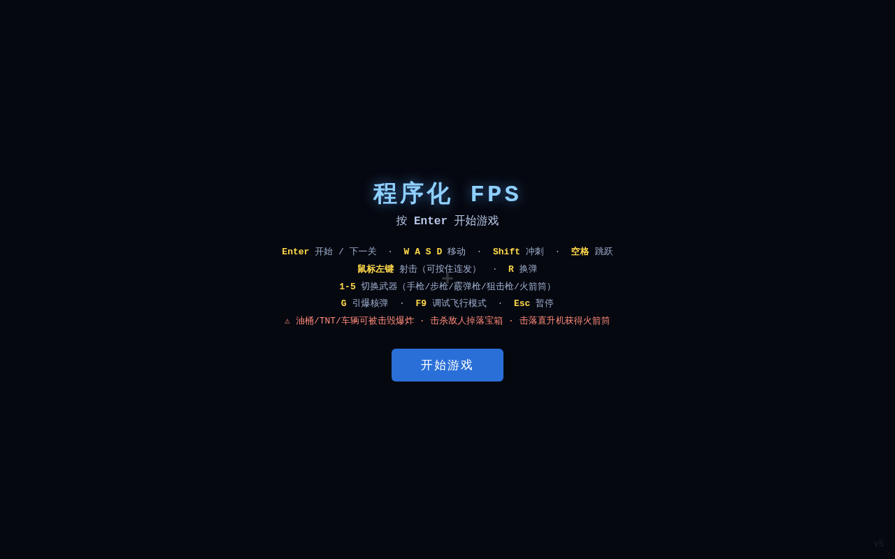

# 🎮 程序化 FPS 射击游戏

一个**零依赖、纯前端、程序化生成**的第一人称射击游戏。双击 `index.html` 即可游玩 —— 无服务器、无构建、无安装。


> 📌 所有模型（敌人、枪械、建筑、树木）全部由 three.js 代码程序化生成，**没有任何外部美术资源**。音效由 WebAudio 实时合成。



## ✨ 功能特性

- 🔫 **5 种武器**：手枪 / 步枪 / 霰弹枪 / 狙击枪 / 火箭筒
  - 每种武器伤害、射速、弹匣、换弹时间、射程、散射均不同
  - 数字键 `1-5` 切换；击毁直升机获得火箭筒（5 发炮弹）
- 💥 **爆头机制**：命中头部伤害 ×5，暴击概率 20%（×3 伤害，40% 概率秒杀普通敌人）
- 🗺️ **双关卡**：第 1 关沙漠据点 + 第 2 关火车场景（站台/铁轨/车厢/远山动态云彩）
- 🤖 **三类敌人**：普通士兵（human）/ 重装怪（monster）/ BOSS，AI 持枪瞄准、靠近站定射击、受击闪红、倒地死亡
- 🚁 **直升机**：每关最多 2 次出现，发射火箭弹（命中 AOE 爆炸半径 3.5），击毁后掉落火箭筒
- 💊 **宝箱道具**（30 秒限时）：
  - 疾风：移动速度 +100%
  - 狂暴：伤害 +200%
  - 体魄：最大生命 +200% 并回满血
  - 核弹：按 G 引爆，毁灭全场敌人（不清关，敌人继续刷新）
- 📦 **弹药随机掉落**：击杀敌人 / 开宝箱 30% 概率掉落弹药包
- ✨ **视觉特效**：弹道曳光、枪口闪光、命中火花 + 扩散环、后坐力动画、爆炸碎片
- 🔊 **程序化音效**：所有音效由 WebAudio 实时合成，无外部文件
- 🛡️ **健壮性**：任何模块加载失败不崩溃，错误面板提示 + 占位模型兜底
- 🎮 **调试模式**：按 F9 开启，重力为零、无碰撞、自由飞行

## 🎮 操作说明

| 操作 | 按键 |
| --- | --- |
| 移动 | `W A S D` |
| 冲刺 | `Shift` |
| 跳跃 | `Space` |
| 射击（可连发） | 鼠标左键 |
| 换弹 | `R` |
| 切换武器 | `1 2 3 4 5`（手枪/步枪/霰弹枪/狙击枪/火箭筒） |
| 进入下一关 | `Enter` |
| 引爆核弹 | `G` |
| 调试飞行模式 | `F9` |
| 暂停 | `Esc` |

## 📋 更新履历

### v5（2026-09-04）
- ✅ 修复完成第一关按 Enter 进下一关后玩家无法移动、无法开枪、无敌人出现的 Bug（根因：nextLevel() 未设置 state='playing' 且未隐藏 overlay）
- ✅ 修复点击完成界面按钮也可进入下一关
- ✅ 道具效果时限改为 30 秒，超时自动恢复原始状态（速度/伤害 buff 归零，maxHealth 恢复原始值）
- ✅ 移动速度 buff 加成由 +50% 提升为 +100%
- ✅ HUD 右下角显示当前版本号
- ✅ 新增第 2 关火车场景（站台、铁轨、车厢、远山、动态云彩）
- ✅ 直升机每关最多 2 次，攻击改为火箭弹（命中 AOE 爆炸）
- ✅ 宝箱每关最多 2 个，击杀敌人/开宝箱 30% 概率掉落弹药
- ✅ 核弹不清关，敌人继续刷新；对玩家造成 maxHealth×30% 伤害

### v4（2026-09-03）
- ✅ 新增第 2 关火车场景
- ✅ 直升机限 2 次 + 火箭弹攻击
- ✅ 弹药 30% 随机掉落
- ✅ 宝箱限 2 个
- ✅ 核弹 30% 伤害机制

### v3（2026-09-02）
- ✅ 回车开始/进入下一关（移除 E 键）
- ✅ 三类敌人 + BOSS 触发
- ✅ 直升机火箭筒掉落
- ✅ 爆炸碎片 + 宝箱 + 核弹机制

### v2（2026-09-01）
- ✅ 敌人子弹命中圆柱体判定（爆头 ×3）
- ✅ 持枪姿势
- ✅ 弹道/后坐力/击中特效
- ✅ 4 枪械 + 随机掉落
- ✅ 5 关卡任务系统

### v1
- ✅ 基础 FPS 框架
- ✅ 3 种武器（手枪/步枪/霰弹枪）
- ✅ 基础敌人 AI

## 🚀 运行方式

### 方式一：直接打开（推荐，零配置）
```bash
# 双击即可
open index.html    # macOS
# 或 Windows 双击 index.html
```

### 方式二：本地静态服务器
```bash
# 使用 Python
python3 -m http.server 8000
# 浏览器打开 http://localhost:8000

# 或使用 Node
npm start          # 启动 http-server
```

### 方式三：GitHub Pages 在线游玩
推送到 GitHub 后，在仓库 **Settings → Pages** 选择 `main` 分支 `/` 目录部署即可，几分钟后即可通过 `https://<用户名>.github.io/<仓库名>/` 在线游玩。

## 🗂️ 项目结构

```
fps-game/
├── index.html          # 主程序（全部核心逻辑内联）
├── three.min.js        # three.js r147 UMD 本地库
├── scene-layout.js     # 场景布局 Level 1（沙漠据点）
├── scene-layout-level2.js  # 场景布局 Level 2（火车场景）
├── DESIGN.md           # 设计文档
├── README.md           # 本文件
├── LICENSE             # MIT License
├── screenshot.png      # 游戏截图
├── models/             # 程序化模型（每个文件一个独立模块）
│   ├── enemy.js        # 敌人（持枪 AI + 动画 + 子弹 + 爆头判定）
│   ├── gun.js          # 第一人称枪械（5 种武器外观 + 后坐力）
│   ├── weapon.js       # 武器拾取物
│   ├── building.js     # 建筑（房屋/仓库）
│   ├── tree.js         # 树木
│   ├── crate.js        # 箱子掩体
│   ├── wall.js         # 围墙
│   ├── floor.js        # 地板
│   ├── target.js       # 射击靶
│   ├── pickup.js       # 血包/弹药拾取物
│   ├── sky.js          # 天空盒
│   ├── lamp.js         # 灯柱
│   ├── obstacle.js     # 障碍物
│   ├── spawner.js      # 刷怪点
│   ├── mountain-scenery.js  # 山脉+云彩模型（Level 2）
│   └── helicopter.js   # 直升机（火箭弹攻击 + AOE 爆炸）
```

## 🧰 技术栈

- **Three.js r147**（经典 script 引入，无打包器）
- **原生 JavaScript**（ES5/ES6 兼容，无框架）
- **WebAudio API**（程序化音效）
- **Pointer Lock API**（鼠标视角）

## 📝 开发约定

- 模型文件统一注册到 `window.MODELS[name]`，接口为 `{ create(config, ctx), update?(inst, dt, ctx), onHit?(inst, point, ctx) }`
- 场景布局通过 `window.SCENE_LAYOUT` / `window.SCENE_LAYOUT_LEVEL2` 配置，支持自定义实体属性
- 敌人 AI 全部封装在 `models/enemy.js`，主程序只做通用加载与渲染
- 任一模块加载失败不得影响主程序，显示错误面板 + 占位模型兜底

## 📄 License

[MIT](LICENSE) © 2026

---

**试玩愉快！如果喜欢这个项目，欢迎 ⭐ Star。**
