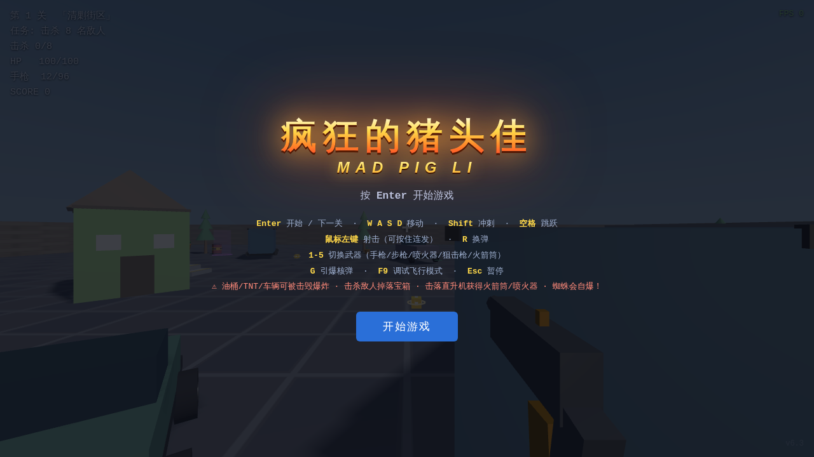

# 🎮 程序化 FPS 射击游戏

一个**零依赖、纯前端、程序化生成**的第一人称射击游戏。双击 `index.html` 即可游玩 —— 无服务器、无构建、无安装。


> 📌 所有模型（敌人、枪械、建筑、树木）全部由 three.js 代码程序化生成，**没有任何外部美术资源**。音效由 WebAudio 实时合成。



## ✨ 功能特性

- 🔫 **5 种武器**：手枪（沙漠之鹰造型）/ 步枪（AK-47 造型）/ 喷火器 / 狙击枪 / 火箭筒
  - 每种武器伤害、射速、弹匣、换弹时间、射程、散射均不同；枪模程序化还原真实枪型
  - 数字键 `1-5` 或**鼠标滚轮**切换；右键瞄准（狙击 4 倍镜）；击毁直升机获得火箭筒（5 发炮弹）
- 📻 **对讲机空袭道具**：击杀 BOSS/直升机 10% 掉落，按 `T` 呼叫导弹空袭（1 次有效）；**每获得 5000 分额外奖励空袭 ×1 + 满血恢复**
- 🌳 **程序化场景**：大树 / 高墙 / 摩天轮 / 草地花丛 / 巨石随机分布，空中 2 种飞鸟盘旋
- 🔊 **程序化战斗 BGM**：每关一首 WebAudio 实时合成劲爆战斗曲（L1-L5 节奏/调式递增），无尽模式专属曲，`M` 键静音
- 💥 **爆头机制**：命中头部伤害 ×5，暴击概率 20%（×3 伤害，40% 概率秒杀普通敌人）
- 🗺️ **5 关卡任务模式**：每关击杀目标递增（30/50/70/90/110），地图程序化随机生成
- 🤖 **三类敌人 + 机甲 BOSS**：普通士兵（human）/ 重装怪（monster）/ 蜘蛛（自爆），第 3 关起巨型机甲 BOSS 现身（血量×3、防御×2、火箭炮武器，每关造型不同），击败奖励核弹
- ♾️ **无尽模式**：菜单选择「无尽模式」→ 随机地图 + 无限波次 + BOSS 随机出现（15%），生命耗尽结束，记录最高击杀 / 最高分
- 🚁 **直升机**：每关最多 2 次出现，发射火箭弹（命中 AOE 爆炸半径 3.5），击毁后掉落火箭筒
- 💊 **宝箱道具**（每关 30% 几率出现，击杀敌人掉落；30 秒限时，超时恢复原状态）：
  - 疾风：移动速度 +100%
  - 狂暴：伤害 +200%
  - 体魄：最大生命 +200% 并回满血
  - 核弹（10% 机率开出）：按 G 引爆，毁灭全场敌人与地图，但会对玩家造成 30% 伤害（生命不足 30% 时引爆会被炸死）
- 📦 **弹药随机掉落**：击杀敌人 / 开宝箱 30% 概率掉落弹药包
- ✨ **视觉特效**：弹道曳光、枪口闪光、命中火花 + 扩散环、后坐力动画、爆炸碎片
- 🔊 **程序化音效**：所有音效由 WebAudio 实时合成，无外部文件
- 🛡️ **健壮性**：任何模块加载失败不崩溃，错误面板提示 + 占位模型兜底
- 🎮 **调试模式**：按 F9 开启，重力为零、无碰撞、自由飞行

## 🎮 操作说明

| 操作 | 按键 |
| --- | --- |
| 移动 | `W A S D` |
| 冲刺 | `Shift` |
| 跳跃 | `Space` |
| 射击（可连发） | 鼠标左键 |
| 瞄准（狙击 4 倍镜） | 鼠标右键 |
| 切换武器（循环） | 鼠标滚轮 |
| 切换武器 | `1 2 3 4 5`（手枪/步枪/喷火器/狙击枪/火箭筒） |
| 呼叫空中支援（对讲机） | `T` |
| 换弹 | `R` |
| 进入下一关 | `Enter` |
| 引爆核弹 | `G` |
| 调试飞行模式 | `F9` |
| 暂停 | `Esc` |

## 📋 更新履历

### v7.9（2026-09-06）
- 🔫 **武器模型全面重做 + 残缺 bug 彻底修复**：六把枪（沙漠之鹰 / AK-47 / 泵动霰弹 / 喷火器 / 狙击 / 火箭筒）全部重新建模，参考 PSX/LowPoly 游戏枪械造型（轮廓清晰、色块鲜明、材质提亮）。**根因修复**：旧版枪托/肩垫等部件位于相机后方（z>0），宽 FOV 下投影翻转 + 屏幕裁切导致残缺、仅右键瞄准（FOV 缩小）才正常——新模型所有部件收敛到相机前方视锥内，并通过 `gunClipTest` 钩子自动验证 6 把枪全部 NDC 投影在视锥内（0 残缺）
- 💥 **火箭筒伤害 +50%**：140 → **210**，爆炸伤害 170 → **255**
- 🐗 **猪头佳超时自爆 30 秒 → 90 秒**（HUD/toast/横幅同步）
- 🛡 **护盾 30 秒 → 15 秒**：击杀续时 +0.5 秒不变，但上限从 60 秒降为**不超过初始 15 秒**
- ⚡ **性能优化（内存/流畅度）**：① renderer pixelRatio 上限 2 → 1.5（高 DPI 屏渲染像素 -40%）；② 特效数组上限 450（长时间游玩不再无限增长，超出丢弃最老特效并释放）；③ 碎片/弹壳共享几何 + 碎片关闭投影阴影；④ collideEnemies/randomSpawnPos 复用全局 Box3（消除每帧临时对象）
- 🧪 测试钩子：新增 gunClipTest（6 枪视锥）、gunStatsTest、perfTest，扩展 pigSpeedTest（life=90）；test_v79.py 全量通过（含 v7.4~v7.8 回归）

### v7.8（2026-09-06）
- ☢️ **核弹上限 1**：新增统一发放入口 `grantNuke()`——宝箱/猪头佳/BOSS/直升机四类掉落全部收敛为「已有 1 颗不再发放」，不使用不能累积、不能重复拾取
- 📻 **空中支援上限 1**：5000 分奖励不再累积（`walkieBonus` 恒为 0/1）；已有空袭（对讲机或奖励次数）时 BOSS/直升机的对讲机掉落与拾取均被拒绝，奖励只回满血；使用后归零
- 🧪 测试：新增 itemCapTest（核弹/空袭上限与不重复拾取），awardMilestoneTest 更新为新语义（跨门槛不累积、用后归零）；test_v78.py 全量通过（含回归）

### v7.7（2026-09-06）
- 🐗 **猪头佳强化**：对玩家攻击伤害 **+50%**（冲撞基础伤害 5~20 → 8~30，钳制后 8~20；绿色激光对玩家每秒 20 → **30**，主程序钳制上限仍为 20）；移动速度 **+40%**（13 → 18.2）
- 🤖 **BOSS 机甲强化**：伤害 **+50%**（第 3/4/5 关 24/30/36 → **36/45/54**，钳制上限 20）；移动速度 **+40%**（1.0/1.15/1.3 → **1.4/1.61/1.82**，spawnBoss 改为读取关卡配置并按比例提升）
- 🧱 **大体型敌人穿模修复**：新增 `collideBigEntities` 3D 挡体——猪头佳 / BOSS 机甲身体高大（scale 3~4.2），此前玩家能直接从其正下方穿过；现在只要玩家水平投影侵入其模型 AABB 且脚底低于模型顶部，就会被水平推挤到实体之外；玩家跳到高于实体顶面时可从上方越过（不阻挡）
- 🔫 **加特林枪管显示修复**：修复主循环每帧强制 `gunInst.visible = !scopeOn` 覆盖 enterGatling 隐藏的 bug——现在加特林碉堡开火时隐藏玩家的手持枪、只见加特林枪管（超温/退出正确恢复）
- 🧪 测试钩子：新增 pigSpeedTest / pigPlayerDmgTest / pigLaserDpsValueTest / bossStatsTest / collideBigTest / gatlingGunVisibleTest；test_v77.py 全量通过（含 v7.4/v7.5/v7.6 回归）

### v7.6（2026-09-06）
- 💪 **血量再提升 200%**：猪头佳 **4000→12000**（+200%）、BOSS 机甲 **7500→22500**（+200%）
- 🛡️ **护盾击杀续时下调**：金色护盾期间每击杀一名敌人提供的增幅从 **+2 秒 → +0.5 秒**（60 秒上限不变）
- 🔊 **BGM 音量 +50%**：背景音乐主输出增益 **0.16 → 0.24**（六首曲目统一提升 50%，M 键静音/恢复同步生效）
- 🧪 测试钩子：更新 enemyHealthTest（pig 12000 / boss 22500），新增 shieldKillTest（+0.5 秒 & 60 秒上限）、bgmVolumeTest（主音量 0.24 = 基线 150%）；test_v76.py 全量通过（含 v7.4/v7.5 回归）

### v7.5（2026-09-06）
- 🔦 **猪头佳激光俯角优化**：激光不再水平直射，改为 **30°~50° 俯角向下扫射**前方地面——俯角随时间往复摆动，视觉上光束在地面来回扫动；伤害判定升级为 **3D 射线**（从双眼间中轴以俯角射向地面），**能扫到落点附近的低矮地面小目标**（蜘蛛/普通敌人/玩家脚边），远处的目标（不在光束路径上）不再被"隔空命中"，直升机/猪自身依旧豁免；俯角落点随摆动在猪前方约 6.5~8.9 米区域移动
- 🧪 测试：新增 pigLaserPitchSweepTest（30°/40°/50° 相位验证），更新激光三连测试落点到地面目标；test_v75.py 全量通过

### v7.4（2026-09-06）
- 💪 **敌人血量强化**：直升机 **250→750**（+200%）、猪头佳 **1000→4000**（+300%）、BOSS 机甲 **1500→7500**（+400%）
- 🔥 **狂暴模式修复**：触发阈值 **15% → 30%**；修复偶发不触发 bug——伤害结算点（hitPlayer 扣血后）立即评估狂暴状态 + 主循环帧评估双保险，不再等下帧才触发
- 🧱 **穿模修复**：蜘蛛（爆炸蜘蛛）与 BOSS 机甲纳入墙体碰撞推挤（原只处理普通敌人/猪头佳，蜘蛛可直接穿墙）；玩家与所有陆地敌人增加**世界边界硬钳制**（围墙内 ±43.9，猪头佳 ±41.5），宁可靠墙滑行绝不穿出
- 🔫 **加特林碉堡模型重做**：全新造型——低矮混凝土定位底座 + 重型三脚架（前二后一）+ 横置粗电机枪身（散热环+后置机匣+供弹口）+ **6 根裸露转管**环形排列、前后锁环、枪口收束环 + 金色弹链从弹药箱绕进供弹口 + 顶部提把/瞄准镜/枪口状态灯；分层布局杜绝穿模与贴图错误，开火时转管加速旋转
- 🧪 测试钩子：enemyHealthTest / berserkTest / worldBoundPlayerTest / worldBoundSpiderTest / gatlingModelTest

### v7.3（2026-09-06）
- 🎁 **5000 分里程碑奖励**：每获得 **5000 分**奖励 **空中支援 ×1**（可累积，按 T 呼叫时优先消耗，不受拾取对讲机 1 次限制）+ **生命值恢复满血**；跨过关卡/无尽持续累计（击杀敌人/BOSS/直升机/猪头佳加分均计入）
- 👁️ **猪头佳激光武器**：两只眼睛向正前方地面发射 **绿色激光**——射程 **200**、**每次持续 5 秒 / 间隙 3 秒**；对玩家造成 **每秒 20 伤害**（钳制上限）、对其它敌人造成 **每秒 50 无差别伤害**；激光沿地面直线扫射（不伤直升机与猪自身），命中判定带光束宽度；双光束视觉特效（亮绿外圈 + 高亮核心），死亡/自爆自动熄灭
- 🐗 **猪头佳出现时机**：覆盖**所有关卡 + 无尽模式**，每击杀 **10 名普通敌人**随机出现（同屏最多 1 只，v7.1 起已生效，本轮测试验证）
- 🧪 测试钩子：新增 pigTriggerTest / pigLaserStateTest / pigLaserPlayerTest / pigLaserEnemyTest / pigLaserRangeTest / awardMilestoneTest

### v7.2（2026-09-06）
- 🔫 **按更新武器道具表调整武器参数**：
  - 手枪：伤害 28→**60**、射速 4→**6 发/秒**、换弹 0.78→**0.5 秒**
  - 步枪：伤害 20→**35**、射速 9→**15 发/秒**、换弹 1.17→**1 秒**；改为**初始自带**（开局滚轮可切，不再从掉落出现）
  - 喷火器：伤害 216→**100/秒**、射速 12→**35 次/秒**、换弹 2.0→**1.5 秒**、射程 80→**60**
  - 狙击枪：伤害 120→**300**、射速 0.9→**1 发/秒**、换弹 1.82→**2 秒**、射程 260→**300**
  - 火箭筒：射程 240→**200**
  - 加特林碉堡：伤害 16→**40**、射速 22→**30 发/秒**、射程 90→**120**（DPS 提升至 1200）
- 📦 **道具调整**：
  - 武器掉落移除步枪（初始自带），重分配为 火箭筒 20% / 狙击枪 35% / 喷火器 45%
  - 宝箱出现概率 30%→**50%**（每关最多 1 个）
  - 宝箱道具概率：疾风 40% / 狂暴 40% / 体魄 10%（核弹 10%）——体魄原表 30% 与 40+40+30+10=120% 超限，按 10% 补齐
  - 猪头佳掉落：空袭对讲机/核弹 10%→**30%**

### v7.1（2026-09-06）
- 📊 **按更新图鉴表全面调整敌人参数**（血量/伤害/速度/射程/攻击间隔/击杀分/掉落）：
  - 👤 **人类士兵**：血量 60、速度 1、射程 15、攻击间隔 3 秒；掉落改为 弹药 60% / 回血 30% / 金色护盾 10%
  - 👹 **怪物**：血量 90、伤害 10、攻击间隔 4 秒；掉落同人类士兵
  - 🕷️ **蜘蛛**：伤害 20、攻击间隔 4 秒；新增击毁掉落 火箭筒 10% / 喷火弹药 10%
  - 🚁 **空袭直升机**：血量 250、伤害 20；所有关卡+无尽模式持续来袭（移除每关最多 2 次限制）；掉落改为 火箭筒 30% / 喷火弹药 30% / 对讲机 20% / 核弹 20%
  - 🤖 **机甲 BOSS**：所有关卡+无尽模式统一改为 **每击杀 25 名普通敌人随机出现**；血量 1500、速度 1、射程 35、攻击间隔 1 秒、击杀 +2000 分；掉落改为 **核弹×1 + 空袭对讲机×1**（对讲机必掉）
  - 🐗 **猪头佳小BOSS**：触发改为 **每击杀 10 名普通敌人**；血量 1000；撞玩家伤害提升至 **5~20**；新增击毁掉落 火箭筒 20% / 喷火弹药 20% / 对讲机 10% / 核弹 10% / 回血 30% / 金色护盾 10%
- 🧹 无尽模式 BOSS 统一走 25 杀机制（移除原 15% 随机出现）；蜘蛛击杀分修正为 150

### v7.0（2026-09-06）
- 🐗 **猪头佳小BOSS**：每击杀 **5 名普通敌人**就会随机出现在地图中（同屏最多 1 只），出场持续 **30 秒**，超时它会产生**自爆**（大范围爆炸 + 对附近玩家造成伤害）
- 🐖 **巨型野猪造型**：体型是普通敌人的 **3 倍**，全身棕色毛发、**白色上弯獠牙**、**绿色发光眼睛**、立耳 + 翘尾 + 背脊鬃毛 + 奔跑摆腿动画，外观逼真
- 💥 **无差别冲撞攻击**：在地面快速奔跑（速度 13），不断冲向最近的玩家/敌人/爆炸物——撞玩家每次造成 **5~10 伤害**、撞敌人造成 **30~50 伤害并击退**、**撞到油桶/TNT 会引爆**（猪自身也会被炸伤）；撞墙被推挤不穿模
- ✍️ **主界面标题调细**：主标题「疯狂的猪头佳」字体由 900 加粗调细为 500，观感更精致
- 🧪 测试钩子：#test 模式新增 spawnPigTest / advancePig / killPigTest / triggerPigCounter / pigPos / spawnBarrelTest 等

### v6.9（2026-09-06）
- 🔫 **枪模残缺修复**：所有枪械紧凑化 + 提亮（枪身更完整、金属质感更强）
- 🔄 **换弹 / 枪口喷火 / 抛壳动画**：换弹夹（弹匣抽出装入、泵动、拉机柄）、喷火枪持续喷火、射击抛黄铜弹壳
- 💣 **爆炸物&火箭筒群体伤害**：油桶/TNT/火箭筒对敌人伤害 +150%（×2.5 群体爆炸）
- ☢️ **直升机 10% 掉落核弹** + 核弹**强闪光 + 蘑菇云**特效
- 🛡️ **金色护盾道具**：击杀 20% 掉落，拾取获得 30 秒护盾（减伤 90%，击杀敌人 +2 秒）

### v6.8（2026-09-06）
- 😡 **狂暴模式**：血量低于 15% 触发，狂暴期间每击杀 1 敌人恢复 10 HP，子弹附带爆炸
- 🔥 **喷火器突围增强**：持续伤害 54→216/秒、射程 45→80、伤害范围 3→9
- 🎯 **加特林机枪碉堡**：每关随机 1 座，按 E 站桩操作 30 秒无限子弹，超温冷却 30 秒

### v6.7（2026-09-06）
- 🌳 **场景大美化**：新增 5 种随机场景模型——大树（粗干+多层球形树冠）、混凝土高墙（带垛口掩体）、摩天轮（A 型支腿+旋转吊舱）、草地花丛（草簇+彩色小花）、巨石堆（可作低矮掩体），每关地图随机分布
- 🐦 **空中飞鸟**：2 种飞鸟（白海鸥 / 深灰猎鸟）随机 2~4 群绕地图上空盘旋，翅膀扇动动画
- 🔫 **真实枪械外观重做**：手枪仿**沙漠之鹰**（方正滑套+锯齿纹+大型握把+击锤）、步枪仿 **AK-47**（木质护木枪托+弧形弹匣+导气管+准星）、泵动霰弹枪、栓动狙击（高倍镜+脚架）、喷火器（双燃料罐）、火箭筒（喇叭口+弹头）；掉落拾取模型同步按真实枪型微缩
- 📻 **对讲机空袭道具**：击杀 BOSS 或直升机 **10% 概率掉落**（每关随机出现），外形逼真（天线+格栅+屏幕+红色通话键）；按 **T** 呼叫空中支援——多枚导弹从天而降轰击敌人区域（每颗 450 范围伤害，不伤玩家）；**1 次有效**，重复拾取不累积
- 🎯 **右键瞄准**：所有枪械按住鼠标右键放大瞄准（灵敏度自动降低），狙击枪出现 **4 倍瞄准镜**（镜头遮罩+十字线）
- 🖱️ **鼠标滚轮循环切换武器**（自动跳过未获得的火箭筒）
- ⚖️ **敌人伤害钳制**：敌人对玩家单次伤害钳制在 **5~20** 之间，彻底杜绝一击必杀（核弹自伤 30% 不受影响）

### v6.6（2026-09-05）
- 🎵 **每关劲爆战斗背景音乐**：WebAudio 程序化实时合成（无需外部文件），6 首风格各异的战斗曲：
  L1 巷战冲锋（132 BPM 电子）· L2 火力围猎（148 BPM 快节奏）· L3 机甲降临（重低音金属）·
  L4 钢铁洪流（156 BPM 双踩）· L5 终焉之战（170 BPM 终局史诗）· 无尽鏖战（无尽模式专属）
- 🔁 关卡切换自动换曲（过关模式逐关更换，无尽模式固定无尽曲）；暂停/死亡/通关自动停止，恢复继续
- 🔇 **M 键静音/恢复**背景音乐（HUD 提示 + 按键说明）

### v6.5（2026-09-05）
- 🎯 **击杀目标上调**：第 1 关 30 人、第 2 关 50 人、第 3 关 70 人、第 4 关 90 人、第 5 关 110 人（之后每关 +20）
- 🤖 **巨型机甲 BOSS**：替换原人形 BOSS，全新金属机甲造型（每关配色不同：红/蓝/绿）；血量 = 普通敌人 ×3、防御 ×2（受到的伤害减半）、武器为**火箭炮**（弹体大、命中或爆炸时范围伤害）；肩部火箭发射器 + 发光面甲 + 胸口反应堆
- ☢️ **击杀 BOSS 奖励核弹**：过关模式与无尽模式击败机甲 BOSS 均获得核弹 ×1
- ♾️ **无尽模式**：菜单可选「过关模式 / 无尽模式」；每次进入随机生成全新地图；无限波次、敌人强度随波次成长；BOSS 随机出现（判定机率 15%，造型随机）；生命耗尽结束并记录**历史最高击杀 / 最高分**（localStorage 持久化）
- 🧪 测试钩子：无尽模式新增 B 键强制召唤随机机甲 BOSS

### v6.4（2026-09-05）
- 🐛 **修复过关判定 Bug**：BOSS 关卡（第 3 关起）此前 `bossAlive` 初始为 false，导致只击杀 1 名敌人就误判「任务完成」；现改为「BOSS 已现身且被击败」才过关，与任务设定一致
- 🔥 **喷火器再增强**：持续伤害 54→108/秒（+100%）、伤害范围 3.0→4.5（+50%）
- 📦 **宝箱机制重做**：每关随机出宝箱几率 30%（击杀敌人时在击杀点附近刷出，每关最多 1 个）；4 种道具随机出现——移动速度 +100% / 伤害 +200% / 生命 +200% / 核弹，道具 30 秒有效、超时恢复原状态
- ☢️ **核弹概率**：开宝箱出现核弹机率 10%（其余三种各 30%）；核弹对全部敌人与地图造成毁灭性伤害，同时会对玩家造成 30% 伤害，生命不足 30% 时引爆会被炸死

### v6.3（2026-09-05）
- 🎨 标题页双排艺术标题：主标题「疯狂的猪头佳」（大号琥珀/行楷渐变金字 + 火焰辉光动画），副标题「Mad Pig Li」（Impact 斜体金色小字），主大副小
- 标题重命名同步到浏览器标签与暂停界面

### v6.2（2026-09-05）
- 🔥 **喷火器全面增强**：射程 18→36（+100%）、持续伤害 18→54/秒（+200%）、伤害范围锥形判定基础 2.0→3.0（+50%）、弹匣 5 发、**每发子弹可持续喷火 15 秒**（5 发 ≈ 75 秒连续喷射，弹药按时间消耗）
- 🔥 **喷火弹药补给**：击毁直升机 50% 概率掉落喷火弹药、开宝箱 35% 概率掉落喷火弹药（红色拾取物 +5 发，备用上限 60），切枪保留独立喷火弹药储备
- ❤️ **击杀掉落回血道具**：击杀任意敌人 20% 概率掉落回血道具（+30 HP，绿色拾取物）
- ⚡ **狂暴模式**：生命值 ≤15% 时自动进入——所有武器伤害 +50%、子弹命中带小范围爆炸（不伤自己）、射速 +50%、移动速度 +200%（×3）；生命恢复后自动解除，HUD 实时显示状态
- 🐛 顺带修复：喷火器原为纯视觉粒子无任何伤害（对蜘蛛模型完全无效），v6.2 实现真实持续伤害锥体并覆盖 enemy/spider/boss/直升机

### v6.1（2026-09-05）
- 🐛 修复过关后按 Enter 进下一关玩家卡死、无敌人、大量报错 `Uncaught ReferenceError: randInt is not defined`（根因：`scene-layout.js` 的 `randInt` 是 IIFE 局部变量，主脚本第二关起刷蜘蛛时调用不到 → `buildWave` 抛异常中断 `nextLevel()`，状态卡在 complete）
- ✅ 主脚本内置 `randInt` 辅助函数，并在 `scene-layout.js` 暴露 `window.randInt` 全局（双保险）
- ✅ 新增 `#test` 模式测试钩子（`index.html#test`，正常游玩不可见），支持自动化回归验证

### v6.0（2026-09-04）
- ✅ 修复建筑物碰撞区域过大问题（锥体半径 0.72→0.52，檐口线 0.4→0.1）
- ✅ 换弹时间缩短 35%（reload × 0.65）
- ✅ 修复过关后敌人不再刷新 Bug（波次耗尽时自动补充）
- ✅ 新增场景模型：truck/plane/container/pot
- ✅ 新增蜘蛛敌人（enemy-spider.js）：贴地爬行、自爆攻击
- ✅ 每关地图改为随机组合生成（程序化布局）
- ✅ 建筑物旁自动生成箱子和台阶供攀爬
- ✅ 删除散弹枪，改为喷火器（flamethrower）：5发，近距离高伤害，火焰特效
- ✅ 武器掉落改为火箭筒+喷火器组合
- ✅ 蜘蛛敌人加入波次生成（第二关起随机出现）

### v5.2（2026-09-04）
- ✅ 修复 v5 发布版脚本语法错误导致游戏整体无法运行的严重 Bug（`startGame` 后多余 `}`），脚本恢复执行
- ✅ 确认并保留关卡过渡修复：完成第一关按 Enter 进第二关后，`nextLevel()` 正确设置 `state='playing'`、隐藏 overlay、重新请求指针锁定，玩家可移动/开枪、敌人正常刷新
- ✅ 更新仓库封面截图

### v5（2026-09-04）
- ✅ 修复完成第一关按 Enter 进下一关后玩家无法移动、无法开枪、无敌人出现的 Bug（根因：nextLevel() 未设置 state='playing' 且未隐藏 overlay）
- ✅ 修复点击完成界面按钮也可进入下一关
- ✅ 道具效果时限改为 30 秒，超时自动恢复原始状态（速度/伤害 buff 归零，maxHealth 恢复原始值）
- ✅ 移动速度 buff 加成由 +50% 提升为 +100%
- ✅ HUD 右下角显示当前版本号
- ✅ 新增第 2 关火车场景（站台、铁轨、车厢、远山、动态云彩）
- ✅ 直升机每关最多 2 次，攻击改为火箭弹（命中 AOE 爆炸）
- ✅ 宝箱每关最多 2 个，击杀敌人/开宝箱 30% 概率掉落弹药
- ✅ 核弹不清关，敌人继续刷新；对玩家造成 maxHealth×30% 伤害

### v4（2026-09-03）
- ✅ 新增第 2 关火车场景
- ✅ 直升机限 2 次 + 火箭弹攻击
- ✅ 弹药 30% 随机掉落
- ✅ 宝箱限 2 个
- ✅ 核弹 30% 伤害机制

### v3（2026-09-02）
- ✅ 回车开始/进入下一关（移除 E 键）
- ✅ 三类敌人 + BOSS 触发
- ✅ 直升机火箭筒掉落
- ✅ 爆炸碎片 + 宝箱 + 核弹机制

### v2（2026-09-01）
- ✅ 敌人子弹命中圆柱体判定（爆头 ×3）
- ✅ 持枪姿势
- ✅ 弹道/后坐力/击中特效
- ✅ 4 枪械 + 随机掉落
- ✅ 5 关卡任务系统

### v1
- ✅ 基础 FPS 框架
- ✅ 3 种武器（手枪/步枪/霰弹枪）
- ✅ 基础敌人 AI

## 🚀 运行方式

### 方式一：直接打开（推荐，零配置）
```bash
# 双击即可
open index.html    # macOS
# 或 Windows 双击 index.html
```

### 方式二：本地静态服务器
```bash
# 使用 Python
python3 -m http.server 8000
# 浏览器打开 http://localhost:8000

# 或使用 Node
npm start          # 启动 http-server
```

### 方式三：GitHub Pages 在线游玩
推送到 GitHub 后，在仓库 **Settings → Pages** 选择 `main` 分支 `/` 目录部署即可，几分钟后即可通过 `https://<用户名>.github.io/<仓库名>/` 在线游玩。

## 🗂️ 项目结构

```
fps-game/
├── index.html          # 主程序（全部核心逻辑内联）
├── three.min.js        # three.js r147 UMD 本地库
├── scene-layout.js     # 场景布局 Level 1（沙漠据点）
├── scene-layout-level2.js  # 场景布局 Level 2（火车场景）
├── DESIGN.md           # 设计文档
├── README.md           # 本文件
├── LICENSE             # MIT License
├── screenshot.png      # 游戏截图
├── models/             # 程序化模型（每个文件一个独立模块）
│   ├── enemy.js        # 敌人（持枪 AI + 动画 + 子弹 + 爆头判定）
│   ├── gun.js          # 第一人称枪械（5 种武器外观 + 后坐力）
│   ├── weapon.js       # 武器拾取物
│   ├── building.js     # 建筑（房屋/仓库）
│   ├── tree.js         # 树木
│   ├── crate.js        # 箱子掩体
│   ├── wall.js         # 围墙
│   ├── floor.js        # 地板
│   ├── target.js       # 射击靶
│   ├── pickup.js       # 血包/弹药拾取物
│   ├── sky.js          # 天空盒
│   ├── lamp.js         # 灯柱
│   ├── obstacle.js     # 障碍物
│   ├── spawner.js      # 刷怪点
│   ├── mountain-scenery.js  # 山脉+云彩模型（Level 2）
│   └── helicopter.js   # 直升机（火箭弹攻击 + AOE 爆炸）
```

## 🧰 技术栈

- **Three.js r147**（经典 script 引入，无打包器）
- **原生 JavaScript**（ES5/ES6 兼容，无框架）
- **WebAudio API**（程序化音效）
- **Pointer Lock API**（鼠标视角）

## 📝 开发约定

- 模型文件统一注册到 `window.MODELS[name]`，接口为 `{ create(config, ctx), update?(inst, dt, ctx), onHit?(inst, point, ctx) }`
- 场景布局通过 `window.SCENE_LAYOUT` / `window.SCENE_LAYOUT_LEVEL2` 配置，支持自定义实体属性
- 敌人 AI 全部封装在 `models/enemy.js`，主程序只做通用加载与渲染
- 任一模块加载失败不得影响主程序，显示错误面板 + 占位模型兜底

## 📄 License

[MIT](LICENSE) © 2026

---

**试玩愉快！如果喜欢这个项目，欢迎 ⭐ Star。**
